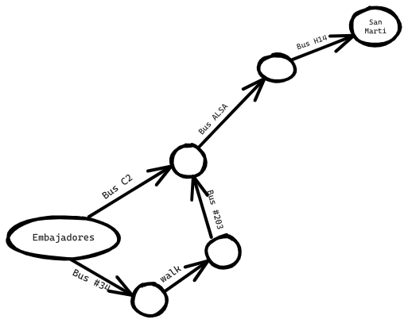
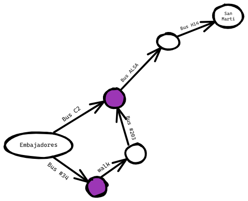
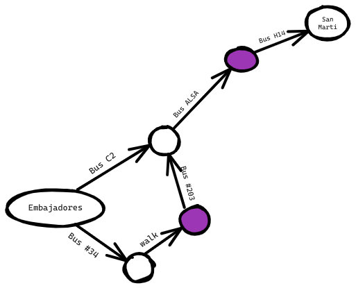
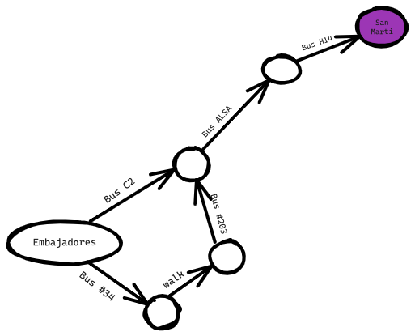
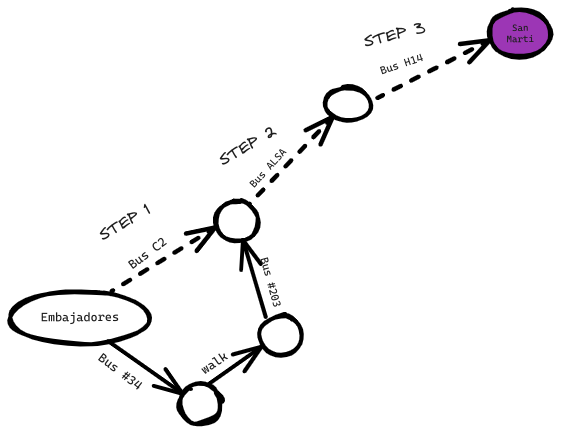
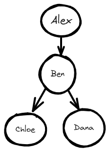
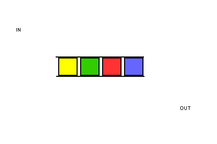
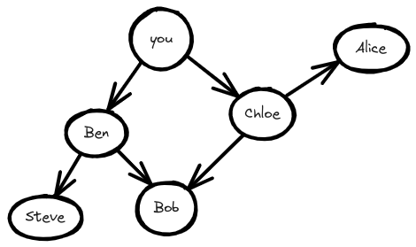
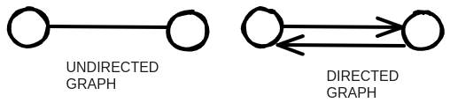

import Tabs from '@theme/Tabs';
import TabItem from '@theme/TabItem';

# Breadth First Search

Breadth-first search allows you to find the shortest distance between two things. But shortest distance can mean a lot of things!
You can use breadth-first search to

- Shortest Path: BFS can be used to find the shortest path between two vertices in an unweighted graph.
- Social Network Analysis: BFS can be used to analyze social networks, such as finding friends or connections within a network.
- Model Checking: BFS is used in model checking techniques to verify the correctness of software or hardware systems.

## Introduction to graphs

Suppose you're in Spain, and you want to go from Embajadores, Madrid to San Marti, Barcelona. You want to get there by Bus, with the minimum number of transfer. Here are your options.





What's your algorithm to find the path with the fewest steps?
Well, can you get there in one step? Here are all the places you can get to in one step.




San Marti isn't highlighted; you can't get there in one step. Can you get there in two steps?



Again, San Marti isn't there, so you can't get to San Marti in two steps.
What about three steps?



Aha! Now San Marti shows up. So it takes three steps to get from Embajadores to San Marti using this route.



There are other routes that will get you to San Marti too, but they're longer (four steps). The algorithm found that the shortest route to San Marti is three steps long. This type of problem is called a shortest-path problem. You're always trying to find the shortest path something. It could be the shortest route to checkmate in a game of chess. The algorithm to solve a shortest-path problem is called breadth-first search.

To figure out how to get from Embajadores, Madrid to San Marti, Barcelona, there are two steps:

- Model the problem as a graph.
- Solve the problem using breadth-first search.

## What is a graph?

A graph models a set of connection.
Let's consider a simple example of social media connections among four individuals: Alex, Ben, Chloe, and Dana. Here is a representation of their social media connections as a graph:




In this graph, each person is represented by a node, and the edges connecting them indicate their social media connections. Alex is connected to Ben, which means Alex follows Ben on social media. Ben is connected to both Chloe and Dana, suggesting that Ben follows both of them. Chloe and Dana are not directly connected, indicating that they are not connected on social media.

This graph visualizes the social media connections between these individuals. It demonstrates that Alex follows Ben, and Ben follows both Chloe and Dana.

Graph are made up of nodes and edges. A node can be directly connected to many other nodes. Those nodes are called neighbors. In this graph, Ben is Alex's neighbor. Chloe isn't Alex's neighbor, because they aren't directly connected. But Ben is Chloe's and Dana's neighbor.

Graph are way to model how different things are connected to one another.

## Breadth-first search

Breath-first search is a different kind of algorithm: one that runs on graphs. It can help answer two types of questions:

1. Is there a path from node A to node B?
2. What is the shortest path from node A to node B?

You already saw breadth-first search once, when you calculated the shortest route from Embajadores to San Marti. That was a question type 2: "What is the shortest path?".
You'll ask a question of type 1: "Is there a path?"

Suppose you're the proud owner of a farm. You're looking for a seller who can sell your products. Are you connected to a product seller on Twitter? Well, you can search through your friends.

This search is pretty straightforward.
First, make a list of your friends to search.

Now, go to each person in the list and check if whether that person sells the type of products you're interest to sell.

Suppose none of your friends are sellers. Now you have to search through your friend's friends.

Each time you search for someone from the list, add all of their friends to the list.

This way, you not only search your friends, but you search their friends, too. With these algorithm, you'll search your entire network until you come across a seller. This algorithm is breadth-first search.

### Finding the shortest path

Can you find the closest seller? For example, your friends are first-degree connections, and their friends are second-degree connections.

You'd prefer a first-degree connections to a second-degree connection, and a second-degree connection to a third-degree connection, and so on. So you shouldn't search any second-degree connections before you make sure you don't have a first-degree connection who is a seller. Well, breadth-first search already does this! The way breadth-first search works, the search radiates out from the starting point.

> Notice that this only works if your search people in the same order in which they're added.

So you need to search people in the order that  they're added. There's a data structure for this: it't called a queue.

### Queues

A queue works exactly like it does in real life. Suppose you and your friend are queuing up at the bus stop. If you're before him in the queue, you get on the bus first. A *queue* works the same way. Queues are similar to stacks. You can't access random elements in the queue. Instead, there are two only operations, *enqueue* and *dequeue*.



The queue is called FIFO data structure: First In, First Out.


## Implementing the graph

First, you need to implement the graph in code. A graph consists of several nodes.

And each note is connected to neighboring nodes.
How do you express a relationship like "you -> bob"?
Luckily, you know a data structure that lets you express relationships: a hash table!

Example:

```python
graph = {}
graph["you"] = ["chloe", "alex", "bob"]
```

Notice that "you" is mapped to an array. So `graph["you"]` will give you an array of all the neighbors of  "you".

What about a graph like this one:




```python
graph = {}
graph["you"] = ["ben", "chloe"]
graph["chloe"] = ["alice", "bob"]
graph["ben"] = ["steve", "bob"]
graph["steve"] = []
graph["bob"] = []
graph["alice"] = []

```


Does it matter what order you add the key/value pairs in?

Hash tables have no ordering, so it doesn't matter what order you add key/value pairs in.

Steve, Bob, and Alice don't have any neighbors. They have arrows pointing to them, but no arrows from them to someone else.
This is called a *directed graph* - the relationship is only one way. An undirected graph doesn't have any arrows, and both nodes are each other's neighbors. For example, both of these graph are equal.



## Implementing the algorithm

Here is how the implementation will work.

1. Keep a queue containing the people to check
2. Pop a person off the queue
3. Check if this person is a seller
4. Depending if the person is a seller:
	1. Yes: You're done
	2. No: Add all their neighbors to the queue

<Tabs>
<TabItem value="js" label="JavaScript">

```js
function search(name) {
	let search_queue = []
	search_queue.push(...graph[name])
	let searched = {} // Keep track of the people you've searched before
	while (searchQueue.length > 0) { 
		let person = searchQueue.shift()
		if (!searched.includes(person)) {  // Only search this person if you haven't already searched
			if (personIsSeller(person)) { 
				console.log(person + " is a seller")
				return true; 
			} else { 
				searchQueue.push(...graph[person])
				 searched.push(person) // Marks this person as searched
			}
		}
	}
	return false;
}
```

</TabItem>
<TabItem value="py" label="Python">

```py
def search(name):
	 search_queue = deque()
	 search_queue += graph[name]
	 searched = [] # Keep track of the people you've searched before
	 while search_queue:
		 person = search_queue.popleft()
		 if not person in searched: # Only search this person if you haven't already searched them.
			 if person_is_seller(person):
			 print person + "is a seller"
			 return True
		 else:
			 search_queue += graph[person]
			 searched.append(person)        # Marks this person as searched
		return False
```

</TabItem>
</Tabs>

### Running time

If you search your entire network for a seller, that means you'll follow each edge. So the running time is at least O(number of edges).

You also keep a queue of every person to search. Adding one person to the queue takes constant time: O(1). Doing this for every person will take O(number of people) total. Breadth-first search takes O(number of people + number of edges), and it's more commonly written as O(V+E) (V for number of vertices, E for number of edges).

## Recap

- Breadth-first search tells you if there's a path from A to B.
- If there is path, breadth-first search will find the shortest path.
- If you have a problem like "find the shortest X", try modeling your problem as a graph, and use breadth-first search to solve it.
- Undirected graphs don't have arrows, and the relationship goes both.
- Queues are FIFO (First in, First Out).
- Once you check someone, make sure you don't check them again.