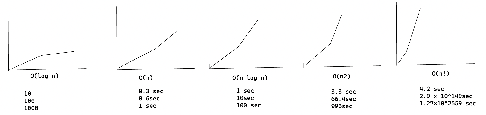
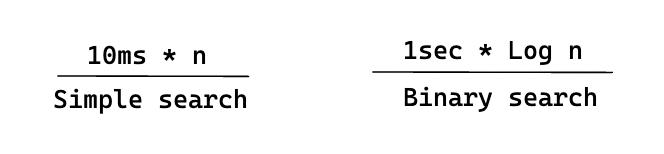
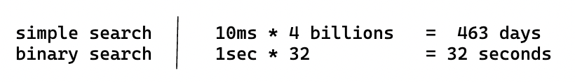

import Tabs from '@theme/Tabs';
import TabItem from '@theme/TabItem';

# Quicksort

Quicksort is a sorting algorithm, and much faster one than selection sort (which you learned before). It's good example
of elegant code.

## Divide & conquer

Quicksort employ an algorithm paradigm based on recursion. This paradigm, divide and conquer, breaks
a problem into sub-problems that are similar to the original problem, recursively solve the sub-problems, and
finally combines the solutions to the sub-problems to solve the original problem. Because D&C solves sub-problems
recursively, each sub-problem must be smaller than the original problem, and there must be a base case for sub-problems.
You should think as D&C algorithm as having 3 parts:

1. **Divide**: the problem into a number of sub-problems that are smaller
   instances of the same problem.
2. **Conquer**: the sub-problems by solving them recursively. If they are
   small enough, solve the sub-problem as base case.
3. **Combine**: the solutions to the sub-problems into the original problem.

## Quicksort in practice

Let's use quicksort to sort an array. What's the simplest array that a sorting algorithm
can handle? Well, some arrays don't need to be sorted at all.

Not need to sort array like this:

- An empty array
- Array with one element

Empty arrays and arrays with just one element will be the base case. You can
just return those arrays as is -there's nothing to sort:

```py
def quicksort(array):
 if len(array) < 2:
  return array
```

Let's look at bigger arrays. An array with two elements is pretty easy to
sort, too.

1. Check if first element is smaller than second.
2. If it isn't, swap them.

What about an array of three elements?

```
[24, 10, 7]
```

Remember, you're using D&C. So you want to break downn this array
until you're at the base case. Here's how quicksort works. First, pick
an element from the array. This element is called the pivot.

We'll talk about how to pick a good pivot later. For now, let's say the first
item in the array is the pivot.

```
<24>
pivot
```

Now find the elements smaller than the pivot and the elements larger
than the pivot.

```
SMALLER       GREATER
        <24>
[10, 7]       [ ]
```

This is called partitioning. Now you have

- A sub-array of all the numbers less than the pivot
- The pivot
- A sub-array of all the numbers less than the pivot  
  The two sub-arrays aren't sorted. They're just partitioned. But
  if they were sorted, then sorting the whole array would be pretty easy.

If the sub-arrays are sorted, then you can combine the whole thing like
this-left array + pivot + right array-and you get a sorted
array. In this case, it's `[7, 10] + [24] + [] = [7, 10, 24]`,
which is a sorted array.

How do you sort the sub-arrays? Well, the quicksort base case already
knows how to sort arrays of two elements (the left sub-array) and
empty arrays (the right sub-array). So if you call quicksort on the
two sub-arrays and then combine the results, you get a sorted array!

```py
quicksort([7, 10] + [24] + [])
> 7, 10, 24 <----- A sorted array
```

This will work with any pivot. Suppose you choose 10 as the pivot instead.

```
[7] <10> [24]
```

Both sub-arrays have only elements, and you know how to sort those. So
now you know to sort an array of three elements. Here are the steps.

1. Pick a pivot.
2. Partition the array into two sub-arrays: elements less than the pivot
   and elements greater than the pivot.
3. Call quicksort recursevely on the two sub-arrays.

What about an array of four elements?

```
[24, 10, 12, 7]
```

Suppose you choose 24 as the pivot again

```
[10, 12, 7] <24> []
```

The array on the left has three elements. You already know how to sort
an array of three elements: call quicksort on it recursevely.

```
[10, 12, 7] <24> []

[7] <10> [12]
```

So you can sort an array of four elements. And if you can sort an array of four you can
sort an array of five elements. Why is that?  
Suppose you have this array of five elements.

```
[3, 5, 2, 1, 4]
```

Here are all the ways you can partition this array, depending on what pivot you choose.

```
[]<1> [3, 5, 2, 4]
[1]<2> [3, 5, 4]
[2, 1]<3> [5, 4]
[3, 2, 1]<4> [5]
[3, 2, 1, 4]<5>[]
```

Notice that all of these sub-arrays have somewhere between 0 and 4
elements. And you already know how to sort an array of 0 to 4 elements
using quicksort! So no matter what pivot you pick, you can call
quicksort recursevely on the two sub-arrays.

For example, suppose you pick 3 as the pivot. You call quicksort on the sub-arrays.

```
qsort([2,1])<3> qsort([5,4])
      [1,2]<3> [4,5]
      [1,2,3,4,5]
```

The sub-arrays get sorted, and then you combine the whole thing to get a sorted array.
This works even if you choose 5 as the pivot.

```
qsort([3,2,1,4])<5>qsort([])
[1,2,3,4]<5>[]
[1,2,3,4,5]
```

This works with any elements as the pivot. So you can sort an array of five elements.
Using the same logic, you can sort an array of six elements, and so on.

### Inductive proofs

You just got a sneak peak into inductive proofs! Inductive proofs are one way to prove that
your algorithm works. Eack inductive proof has two steps: the base case and the inductive case.
Sound familiar? For example, suppose I want to prove that I can climb to the top of a ladder. In the
inductive case, if my legs are on a rung, i can put my legs on the next rung. So if I'm on rung, I can
climb to rung 3. That's the inductive case. For the base case, I'll say that my legs are on rung 1.
Therefore, I can climb the entire ladder, going up one rung at a time.

You use similar reasoning for quicksort. In the base case, I showed that algorithm works for the
base case: arrays of size 0 and 1. In the inductive case, I showed that if quicksort works for
an array of size 1, it will work for an array of size 2 and so on.

## Implementation

<Tabs>
<TabItem value="js" label="JavaScript">

```js
function quickSort(arr) {
  // base case: arrays with 0 or 1 element are already "sorted"
  if (arr.length <= 1) {
    return arr;
  }

  const pivot = arr[0];

  // partition the list into two sub-lists
  let left = [];
  let right = [];
  for (let i = 1; i < arr.length; i++) {
    if (arr[i] < pivot) {
      left.push(arr[i]);
    } else {
      right.push(arr[i]);
    }
  }

  // recursively sort the two sub-lists
  left = quickSort(left);
  right = quickSort(right);

  // combine the sorted sub-lists back into a single, sorted list
  return left.concat(pivot, right);
}
```

</TabItem>
<TabItem value="py" label="Python">

```py
def quicksort(array):
  if len(array) < 2:
    return array
  else:
    pivot = array[0]
    less = [i for i in array[1:] if i <= pivot]
    greater = [i for i in array[1:] if i > pivot]
    return quicksort(less) + [pivot] + quicksort(greater)
```

</TabItem>
</Tabs>

## Big O notation revisited

Quicksort is unique because its speed depends on the pivot you choose.  
Before I talk about quicksort, let's look at the most common Big O run
times again.



> Estimates based on a slow computer that performs 10 operations per second

Each run time also has an example algorithm attached.

There's another sorting algorithm called merged sort, which is O(n log n). Much faster! Quicksort is a tricky
case. In the worst case, quicksort takes O(n^2) time.

It's as slow as selection sort! But that's the worst case. In the average case, quicksort takes O(n log n) time. So
you might be wondering:

- What do worst case and average case means here?
- If quicksort is O(n log n) on average, but merge sort is O(n log n)
  always, why not use merge sort? Isn't faster?

## Merge sort vs. quicksort

Suppose you have this simple function to print every time in a list:

```py
def print_items(list):
  for item in list:
    print item
```

This function goes through every item in the list and prints it out.
Because it loops over the whole list once, this function runs in O(n)
time. Now, suppose you change this function so it sleeps for 1 second
before it prints out an item:

```py
from time import sleep
def print_items2(list):
  for item in list:
  sleep(1)
  print item
```

Before it prints out an item, it will pause for 1 second. Suppose you
print a list of five items using both functions.

[3, 2, 4]

```shell
print_items: 3 2 4

print_items2: <sleep> 3<sleep> 2<sleep> 4
```

Both functions loop through the list once, so the're both O(n) time.
Which one do you think will be faster in practice? I think `print_items` will
be much faster because it doesn't pause for 1 second before printing an item.
So even though both functions are the same speed in Big O notation, `print_items` is
faster in practice. When you write Big O notation like O(n), it really means this.

```
some fixed amount of time -> c * n
```

c is some fixed amount of time that your algorithm takes. It's called the constant.
For example, it might be 10 milliseconds _ n for `print_items` versus 1 second _ n for
`print_items2`.

You usually ignore that constant, because if two algorithm have different Big O times,
the constant doesn't matter. Take binary search and simple search, for example.
Suppose both algorithms had these constants.



Simple search seems to be faster, but what if you're searching in a list of 4 billion elements.
Here are the times.



As you can see, binary search is still way faster. That constant didn't make a difference
at all.

But sometimes the constant can make a difference. Quicksort versus merge sort is an example.

## Average case vs. worst case

In the worst-case analysis, we calculate the upper limit of the execution time of an
algorithm. It is necessary to know the case which causes the
execution of the maximum number of operations.

In the average case analysis, we take all possible inputs and calculate the computation time for all inputs. Add up all
the calculated values and divide the sum by the total number of entries.

## Recap

- D&C works by breaking a probem down into smaller and smaller pieces.
- Iy you're implementing quicksort, choose a random element as the pivot.
  The average runtime of quicksort is O(n log n)!
- The constant in Big O notation can matter sometimes. That's why quicksort
  is faster than merge sort.
- The constant almost never matters for simple search versus binary search,
  because O(log n) is so much faster than O(n) whe your list gets big.
