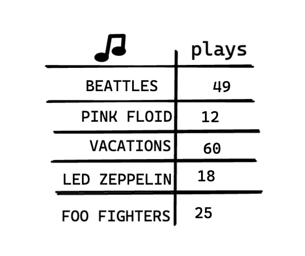
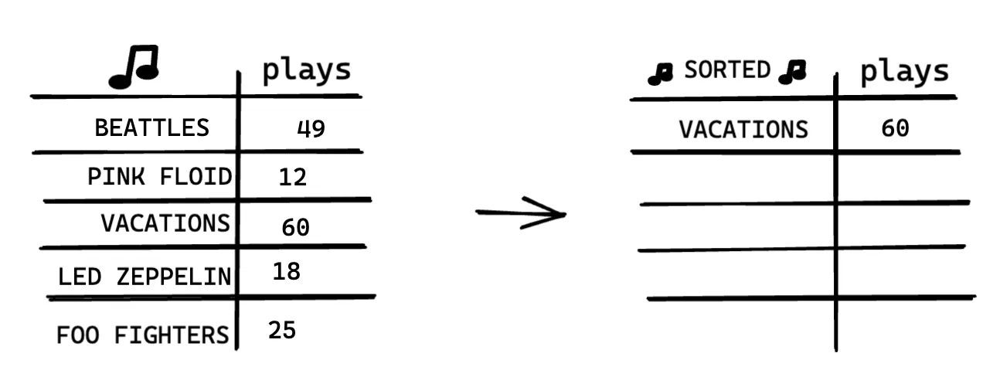
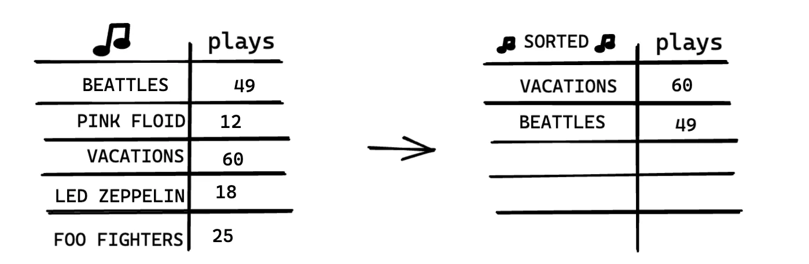
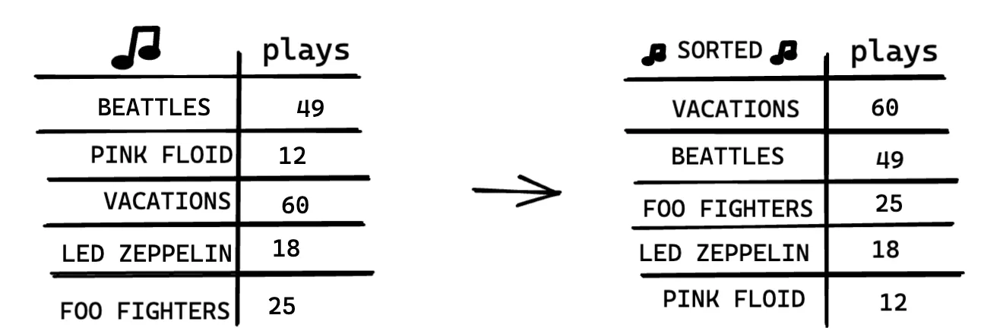

# Selection Sort

> In computer science, selection sort is an in-place comparison sorting algorithm. — Wikipedia

## Analogy


Suppose you have a bunch of songs on your computer.

For each artist, you have a number of plays.



You want to sort this list from most to least played, so that you can rank your favourite artists. How can you do it?

One way is go through the list and find the most played artist. Add that artist to a new list.



Do it again to find the next most played artist.



Keep doing this, and you’ll end up with a sorted list.



## Time complexity

To find the artist with the highest number of plays, you have to check each item in the list. This takes O(n) time,
as you just saw. So you have an operation that takes O(n) time and you have to do that n times:

This tikes O(n x n) time or O(n^2) time.

## Visual representation

Sort an array from smallest to largest.


## Summary

Selection sort is the simplest sorting algorithm that works by repeatedly finding the minimum element (considering ascending order)
from the unsorted part and putting it at the beginning.

## Selection Sort Implementation

```ts
function findSmallest(nums: number[], index: number) {
  let smallest = nums[index];
  let swapIndex = index;
  for (let i = index + 1; i <= nums.length; i++) {
    if (nums[i] < smallest) {
      smallest = nums[i];
      swapIndex = i;
    }
  }
  return { swapIndex, smallest };
}

export default function selectionSort(nums: number[]): number[] {
  for (let i = 0; i < nums.length - 1; i++) {
    const { smallest, swapIndex } = findSmallest(nums, i);
    if (i !== swapIndex) {
      // if smallest is not the current index, swap
      const tmp = nums[i];
      nums[i] = smallest;
      nums[swapIndex] = tmp;
    }
  }
  return nums;
}
```
