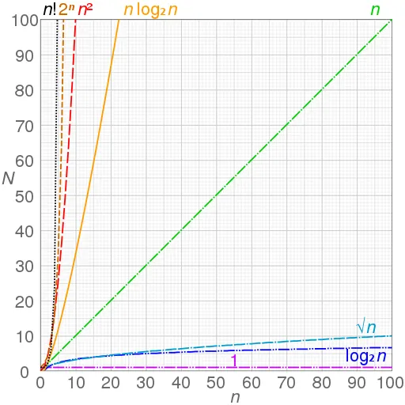

# Big O notation

Big O notation is a special notation that tells you how fast an algorithm is. Okay, but, Who cares? The point is that you'll be using other people's algorithms a lot - and when you do, it's nice to understand how fast or slow they are.

In this section, We'll explain in depth what Big O notation is and give you a list of the most common running times.

## Terminology

The letter O is used because it describes the run time as being on the Order of something, which is a mathematician's way of saying that two things grow similarly.

## What does "Notation" mean?

A notation is a collection of related symbols that are each given an arbitrary
meaning, created to facilitate structured communication within a domain of knowledge
or field of study.

When talking about the big-O run time of a piece of code, the size of the input
data is given a letter name, usually N or n. Then the big-O is
an expression in N that says roughly how many steps
the code will take to execute.

## What is NOT Big O?

With Big O, we don't measure the speed of an algorithm in seconds (or minutes). We measure the rate of growth of an algorithm in the number of operations it takes to complete.
Big O does NOT represent the best scenario. Big O establishes a worst-case time. So you can say that, in the worst case, you'll have run time in order of "number of operations".

## Time and Space Complexity

**Time complexity**: This is what the concept of asymptotic runtime, or big O time, means.

**Space Complexity**: Time is not the only thing that matters in an algorithm, We might also care about the amount
of memory - or space - required by an algorithm.

Space complexity is a parallel concept to time complexity. If we need to create an array of size n, this will require O(n) space. If we need
a two-dimensional array of size n by n, this will require O(n²) space.

## Some common Big O run times

Here are five Big O run times that you’ll encounter a lot, sorted from fastest to slowest:

- O(log n), also known as log time. Example: Binary search.
- O(n), also known as linear time. Example: Simple search.
- O(n \* log n). Example: A fast sorting algorithm, like quicksort.
- O(n²). Example: A slow sorting algorithm, like selection sort.
- O(n!). Example: A really slow algorithm, like the traveling salesperson.

## 4 Important Rules to Understand Big O

### 1. Different steps get Added

This means if have two different steps in your algorithms you add up steps. So if you have a first step that takes O(a)
and a second step that takes O(b) you would up those run times and you get O(a+b).

Example:

```javascript
function doSomething() {
  // doStep1() -> O(a)
  // doStep2() -> O(b)
  // time comeplexity -> O(a+b)
}
```

### 2. Drop Constants

Suppose that we want to print the min and the max element of an array, there are many way, in this case, we have two:

```javascript
function minMax1(array) {
  let max = array[0];
  let min = array[0];

  for (let val of array) {
    if (val > max) max = val;
  }

  for (let val of array) {
    if (val < min) min = val;
  }

  return { min, max };
}
```

```javascript
function minMax2(array) {
  let max = array[0];
  let min = array[0];

  for (let val of array) {
    if (val > max) max = val;
    if (val < min) min = val;
  }

  return { min, max };
}
```

The first function finds the max element and then finds the min element, and the other one finds the min and max simultaneously.
Now, these are fundamentally doing the same thing, they’re doing essentially the exact same operations,
just doing them in slightly different orders.

Both of these get described as O(n) where n is the size of the array. Now it’s really tempting for people to sometimes see two
different loops and describe it as O(2n) and it's important that you remember you drop constants in Big O.

You do not describe things as O(2n), O(3n) -> O(n) because you are looking for how things scale roughly. Is it a linear relationship,
is it quadratic... You always drop constants.

### 3. Different inputs -> Different variables

Big O is an equation that expresses how runtime changes, and how its scales.

Let’s an example where we have two arrays and we’re walking through them to figure out the number of elements in common between
the two arrays:

```javascript
function intersectionSize(arrayA, arrayB) {
  let count = 0;

  for (let a of arrayA) {
    for (let b of arrayB) {
      if (a === b) count = count + 1;
    }
  }

  return count;
}
```

Some people will mistakenly call this O(n²) but that’s not correct. When you just take about runtime if you describe things as O(n),
O(log n), etc. n must have a meaning it’s not like things are inherently one on the other.

When you describe this as O(n²) doesn’t make sense because n it’s not the size of the array, if there are two different
arrays. What you want to describe instead is O(a\*b).

### 4. Drop non-dominate terms

What this simply means is when you have different blocks running at different times the Big O should be the worst scenario.

```javascript
function doSomething() {
  // doStep1() -> O(n)
  // doStep2() -> O(n^2)
  // time comeplexity -> O(n^2)
}
```

In this case, the quadratic runtime is more dominant than the linear runtime.

## The Graph



Graphs of functions commonly used in the analysis of algorithms show the data (input size n) versus time (the number of steps N)
for each function.

## Summary

- Drop the non-dominate terms, Big O establishes a worst-case time.
- Drop constants, you are looking for how things scale roughly.
- O(log n) is faster than O(n), but it gets a lot faster once the list of items you’re searching through grows.
- Algorithm speed isn’t measured in seconds.
- Algorithms times are measured in terms of the growth of an algorithm.
- Algorithms times are written with Big O notation.
