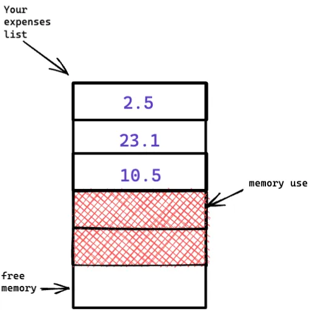
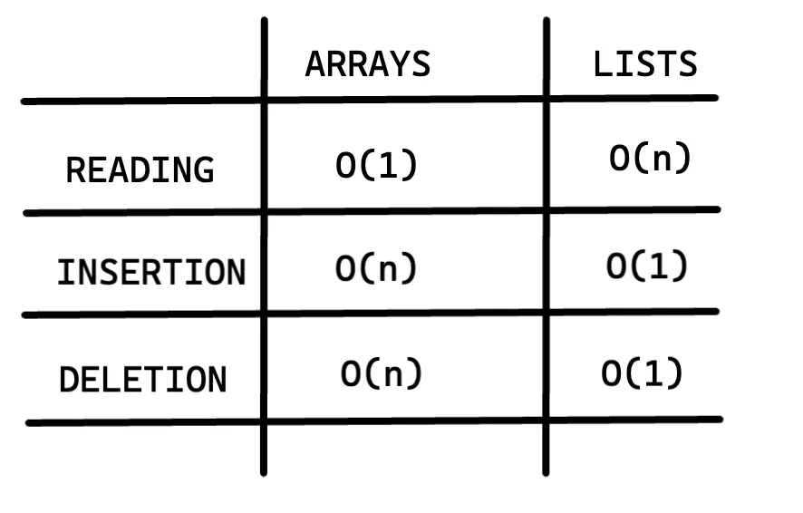

# Arrays and Linked List

Sometimes you need to store a list of elements in memory. Suppose you’re writing an app to manage your expenses. You will want to store the expenses as a list in memory.

Should you use an array, or a linked list? Let’s store the expenses in an array first, because it’s easier to grasp. Using an array means all your expenses are stored contiguously (right next to each other) in memory.

Now suppose you want to add a fourth expense. But the next drawer is taken up.

It’s like going out with your friends and finding a place to sit but another friend joins you, and there’s no place for them. You have to move to a new spot where you all fit. In this case you need to ask your computer for a different chunk of memory that can fit four expenses. Then you need to move all your expenses there.

And this will become a loop as soon as more friends join to you, but sure that you can always add extra slots just in case. This is a good workaround, but you should be aware of a couple of downsides:

You may not need extra slots that you asked for, and then that memory will be wasted.
You may add more than 10 items to your expense list and have to move anyway.
So it’s good workaround, but it’s not a perfect solution. Linked lists solve this problem of adding items.

## Linked lists

A linked list is a linear collection of data elements whose order is not given by their physical placement in memory. Instead, each element points to the next.

With a linked lists, your items can be anywhere in memory.

## Sequential vs Random Access

**Sequential access** means the cost of accessing the 5th element is 5 times the cost of accessing the first element, or at least that there is an increasing cost associated with an elements position in the set. This is because to access the 5th element of the set, you must first perform an operation to find the 1st, 2nd, 3rd, and 4th elements, so accessing the 5th element requires 5 operations.

**Random access** means that accessing any element in the set has the same cost as any other element in the set. Finding the 5th element of a set is still only a single operation.

## Array vs LinkedList

In an array we know the address of each element of the array. As we can see in the image above we have an array with 5 memory units and this array contains 3 elements, as the elements are stored in contiguous memory locations (the elements in an array are numbered and this numbering starts from 0) we know where it starts and where it ends.

> The position of an element is called its index, so instead of saying, “8 is at position 1”, the correct terminology is “8 is at index 1”.

Arrays are great if you want to read random elements, because you can look up any element in your array instantly.

In a linked list each item stores the address of the next item in the list. A bunch of random memory addresses are linked together.

It’s like a treasure hunt. You go to the first address, and it says, “The next item can be found at address 008”. So you go to address 008, and it says, “The next item can be found at address 002” and so on.

Adding an item to a linked list is easy: you stick it anywhere in memory and store the address with the next previous item.

With a linked lists, you never have to move your items. You also avoid another problem.

Let’s say you go to a popular movie with four of your friends. The five of you are trying to find a place to sit, but the movie theatre is packed. There aren’t five seats together.

Well, sometimes this happens with arrays. Let’s say you’re trying to find 40,000 slots, for an array. Your memory has 40,000 slots, but it doesn’t have 40,000 slots together. You can’t get space for your array!

A linked list is like saying “Let’s split up and watch the movie”. If there’s space in memory, you have space for your linked list.

If linked list are so much better at inserts, what are arrays good for?

## Arrays

Arrays are better than linked list when we try to access to our items in the list.

Suppose you want to read the second last item in a linked list. You can’t just read it, because you don’t know what address it’s at.

You have to go to item #1 to get the get the address for item #2 and so on, until you get to the second last item.

Linked lists are great if you’re going to read all the items one at time. But if you’re going to keep jumping around, linked lists are terrible.

Arrays are different. You know the address for every item in your array, so you can access to any item immediately.

## Inserting into the middle of a list

Suppose you want your expense list to work more like a calendar. Earlier, you were adding things to the end of the list.

Now you want to add them in the order in which they should be done.

What’s better if you want to insert elements in the middle: arrays or linked lists? With linked list, it’s easy as changing what the previous element points to.

But for arrays, you have to shift all the rest of the elements down.

And if there’s no space, you might have to copy everything to a new location! Lists are better if you want to insert elements into the middle.

## Deletions

What if you want to delete an element? Again, linked lists are better, because you just need to change what previous element points to. With arrays everything needs to be moved up when you delete an element.

### Run times for common operations on arrays and list:

Insertions and deletions are O(1) time because you commonly will have track the first and last items in a linked list, so would take only O(1) to add or delete.

Which are used more: arrays or linked lists? Obviously, it depends, on the use case. But arrays see a lot of use because they allow random access.
