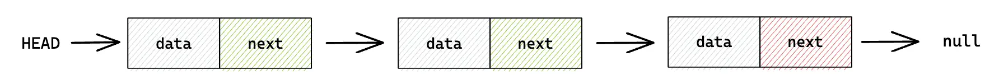

# Types of Linked Lists

There are different types of linked list and in this section you will learn the fundamentals
of the main linked lists.

A Linked list is linear data structure that include a series of connected nodes.

Think of a linked list as a chain of boxes, where each box contains a piece of data, and a pointer
to the next box in the chain. The pointer tells the computer where the next box is located in memory. Unlike arrays,
where data is stored in a fixed-size block of memory, linked lists allow for flexibility in the
size of the data and can be dynamically resized.

For example, imagine a linked list containing the numbers 1, 2, and 3. The first box in the chain would
contain the number 1 and a pointer to the next box. The second box would contain the number 2 and a
pointer to the third box. The third box would contain the number 3 and a null pointer
to indicate the end of the list.

Linked lists are useful in situations where you need to add or remove data frequently, as they can be easily modified
without having to shift large blocks of memory. They are also used in various applications, such as computer graphics,
where they are used to represent shapes or animations.

## Single Linked List

In a singly linked list each node has a reference to the next node in the sequence, but
there is not reference to the previous node. This makes a single linked lists simple and
efficient to implement, but it can make certain operations, such as reversing the list,
more difficult.

## Doubly Linked List

In a doubly linked list, each node has a reference to both the next and the previous
nodes in the sequence. This makes doubly linked lists more versatile than
singly linked lists, but it also requires more memory to store the
extra references.

## Circular Linked List

In a circular linked list, the last node in the sequence has a reference to the first node,
forming a circular structure. This allows for efficient traversal of the list, but
it can also make certain operations, such as finding the end of the list, more
complicated.

