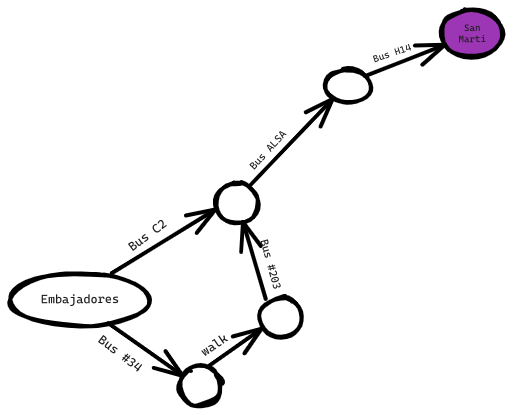
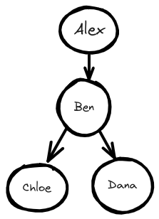
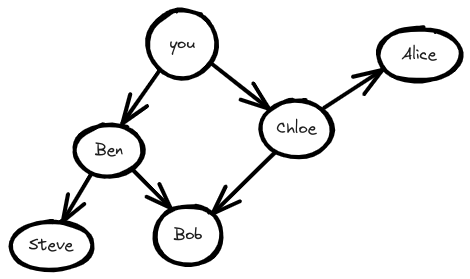

import Tabs from '@theme/Tabs';
import TabItem from '@theme/TabItem';

# Búsqueda en Anchura

La búsqueda en anchura permite encontrar la distancia más corta entre dos cosas. Pero la distancia más corta puede significar muchas cosas.
Puede utilizar la búsqueda breadth-first para

- Camino más corto: BA se puede utilizar para encontrar el camino más corto entre dos vértices en un grafo no ponderado.
- Análisis de redes sociales: BA se puede utilizar para analizar redes sociales, como encontrar amigos o conexiones dentro de una red.
- Comprobación de modelos: La BA se utiliza en técnicas de comprobación de modelos para verificar la corrección de sistemas de software o hardware.

## Introducción a los grafo

Supongamos que estás en España, y quieres ir de Embajadores, Madrid a San Martí, Barcelona. Quieres llegar en Autobús, con el mínimo número de transbordos. Estas son tus opciones.


¿Cuál es tu algoritmo para encontrar el camino con menos pasos?
¿Puedes llegar en un solo paso? Aquí tienes todos los lugares a los que puedes llegar en un solo paso.


San Martí no está resaltado; no se puede llegar en un solo paso. ¿Se puede llegar en dos pasos?


De nuevo, San Martí no está allí, así que no puedes llegar a San Martí en dos pasos.
¿Qué tal tres pasos?



Ahora aparece San Martí. Así que se necesitan tres pasos para ir de Embajadores a San Marti usando esta ruta.


Hay otras rutas que también te llevarán a San Martí, pero son más largas (cuatro pasos). El algoritmo ha encontrado que la ruta más corta a San Martí es de tres pasos. Este tipo de problema se llama problema del camino más corto. Siempre estás tratando de encontrar el camino más corto hacia algo. Podría ser la ruta más corta para dar jaque mate en una partida de ajedrez. El algoritmo para resolver un problema del camino más corto se llama búsqueda en anchura.

Para averiguar cómo llegar de Embajadores, Madrid a San Martí, Barcelona, hay dos pasos:

- Modelar el problema como un grafo.
- Resolver el problema utilizando la búsqueda del camino más corto.

## ¿Qué es un grafo?

Un grafo modela un conjunto de conexiones.
Consideremos un ejemplo sencillo de conexiones en redes sociales entre cuatro individuos: Alex, Ben, Chloe y Dana. He aquí una representación de sus conexiones en las redes sociales en forma de grafo:



En este grafo, cada persona está representada por un nodo, y las aristas que los conectan indican sus conexiones en las redes sociales. Alex está conectado a Ben, lo que significa que Alex sigue a Ben en las redes sociales. Ben está conectado tanto a Chloe como a Dana, lo que sugiere que Ben sigue a ambas. Chloe y Dana no están conectadas directamente, lo que indica que no están conectadas en las redes sociales.

Este grafo muestra las conexiones en las redes sociales entre estas personas. Demuestra que Alex sigue a Ben, y que Ben sigue tanto a Chloe como a Dana.

Los grafo están formados por nodos y aristas. Un nodo puede estar conectado directamente a muchos otros nodos. Esos nodos se llaman vecinos. En este grafo, Ben es vecino de Alex. Chloe no es vecina de Alex, porque no están conectados directamente. Pero Ben es vecino de Chloe y Dana.

Los grafo son una forma de modelar cómo están conectadas entre sí diferentes cosas.

## Búsqueda en anchura

La búsqueda en anchura es un tipo diferente de algoritmo: uno que se ejecuta en grafos. Puede ayudar a responder dos tipos de preguntas:

1. ¿Existe un camino del nodo A al nodo B?
2. ¿Cuál es el camino más corto del nodo A al nodo B?

Ya has visto la búsqueda en anchura una vez, cuando calculaste la ruta más corta de Embajadores a San Martí. Esa fue una pregunta de tipo 2: "¿Cuál es el camino más corto?".
Harás una pregunta de tipo 1: "¿Existe un camino?".

Supongamos que eres el propietario de una granja. Buscas un vendedor que pueda vender tus productos. ¿Estás conectado a un vendedor de productos en Twitter? Pues puedes buscar a través de tus amigos.

Esta búsqueda es bastante sencilla.
Primero, haz una lista de tus amigos para buscar.

Ahora, ve a cada persona de la lista y comprueba si vende el tipo de productos que te interesa vender.

Supongamos que ninguno de tus amigos es vendedor. Ahora tienes que buscar entre los amigos de tus amigos.

Cada vez que busques a alguien de la lista, añade a todos sus amigos a la lista.

De esta forma, no sólo buscas entre tus amigos, sino también entre sus amigos. Con este algoritmo, buscarás en toda tu red hasta dar con un vendedor. Este algoritmo es el de la búsqueda en anchura.


### Encontrar el camino más corto

¿Puedes encontrar al vendedor más cercano? Por ejemplo, tus amigos son conexiones de primer grado, y sus amigos son conexiones de segundo grado.

Preferirías una conexión de primer grado a una conexión de segundo grado, y una conexión de segundo grado a una conexión de tercer grado, y así sucesivamente. Así que no deberías buscar conexiones de segundo grado antes de asegurarte de que no tienes una conexión de primer grado que sea un vendedor. Pues bien, la búsqueda de primer grado ya hace esto. De la forma en que funciona la búsqueda de primer grado, la búsqueda se extiende desde el punto de partida.

> Ten en cuenta que esto sólo funciona si buscas personas en el mismo orden en el que se añaden.

Así que tienes que buscar a las personas en el orden en que se agregan. Hay una estructura de datos para esto: se llama cola.

### Colas

Una cola funciona exactamente igual que en la vida real. Supón que tú y tu amigo estáis haciendo cola en la parada del autobús. Si estás antes que él en la cola, tú subes primero al autobús. Una *cola* funciona de la misma manera. Las colas son similares a las pilas. No puedes acceder a elementos aleatorios de la cola. En su lugar, sólo hay dos operaciones, *enqueue* y *dequeue*.


La cola se denomina estructura de datos FIFO: Primero en entrar, primero en salir.

## Implementación del grafo

Primero, necesitas implementar el grafo en código. Un grafo consiste en varios nodos.

Y cada nodo está conectado a los nodos vecinos.
¿Cómo expresas una relación como "tú -> bob"?
Por suerte, conoces una estructura de datos que te permite expresar relaciones: ¡una tabla hash!

Ejemplo:

```python
graph = {}
graph["you"] = ["chloe", "alex", "bob"]
```

Fíjate en que "tú" es un array. Así que `graph["tú"]` te dará un array de todos los vecinos de "tú".

¿Qué pasa con un gráfico como este:



```python
graph = {}
graph["you"] = ["ben", "chloe"]
graph["chloe"] = ["alice", "bob"]
graph["ben"] = ["steve", "bob"]
graph["steve"] = []
graph["bob"] = []
graph["alice"] = []
```

¿Importa el orden en que se añaden los pares clave/valor?

Las tablas hash no tienen orden, por lo que no importa en qué orden añadas los pares clave/valor.

Steve, Bob y Alice no tienen vecinos. Tienen flechas que apuntan a ellos, pero no flechas de ellos a alguien más.
Esto se llama un *grafo dirigido* - la relación es sólo en un sentido. Un grafo no dirigido no tiene flechas y ambos nodos son vecinos entre sí. Por ejemplo, estos dos grafos son iguales.


## Implementación del algoritmo

Así es como funcionará la implementación.

1. Mantener una cola que contenga las personas a comprobar
2. Sacar a una persona de la cola
3. Compruebe si esta persona es un vendedor
4. Dependiendo de si la persona es un vendedor:
	1. Sí: Ha terminado
	2. No: Añade a todos sus vecinos a la cola

<Tabs>
<TabItem value="js" label="JavaScript">

```js
function search(name) {
	let search_queue = []
	search_queue.push(...graph[name])
	let searched = {} // Keep track of the people you've searched before
	while (searchQueue.length > 0) { 
		let person = searchQueue.shift()
		if (!searched.includes(person)) {  // Only search this person if you haven't already searched
			if (personIsSeller(person)) { 
				console.log(person + " is a seller")
				return true; 
			} else { 
				searchQueue.push(...graph[person])
				 searched.push(person) // Marks this person as searched
			}
		}
	}
	return false;
}
```

</TabItem>
<TabItem value="py" label="Python">

```py
def search(name):
	 search_queue = deque()
	 search_queue += graph[name]
	 searched = [] # Keep track of the people you've searched before
	 while search_queue:
		 person = search_queue.popleft()
		 if not person in searched: # Only search this person if you haven't already searched them.
			 if person_is_seller(person):
			 print person + "is a seller"
			 return True
		 else:
			 search_queue += graph[person]
			 searched.append(person)        # Marks this person as searched
		return False
```

</TabItem>
</Tabs>

### Tiempo de ejecución

Si busca un vendedor en toda la red, significa que seguirá cada arista. Así que el tiempo de ejecución es al menos O(número de aristas).

También mantienes una cola de cada persona a buscar. Añadir una persona a la cola lleva un tiempo constante: O(1). Hacer esto para cada persona llevará O(número de personas) en total. Breadth-first search tarda O(número de personas + número de aristas), y se escribe más comúnmente como O(V+E) (V para el número de vértices, E para el número de aristas).

## Resumen

- La búsqueda en anchura te dice si hay un camino de A a B.
- Si hay camino, la búsqueda en anchura encontrará el camino más corto.
- Si usted tiene un problema como "encontrar el más corto X", trate de modelar su problema como un grafo, y el uso de la búsqueda en anchura para resolverlo.
- Los grafos no dirigidos no tienen flechas, y la relación va en ambos sentidos.
- Las colas son FIFO (primero en entrar, primero en salir).
- Una vez que compruebas a alguien, asegúrate de no volver a comprobarlo.