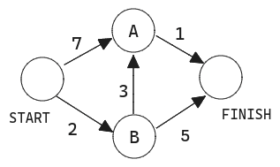
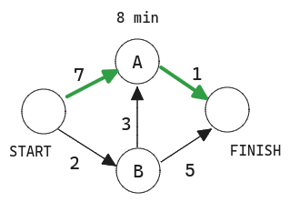
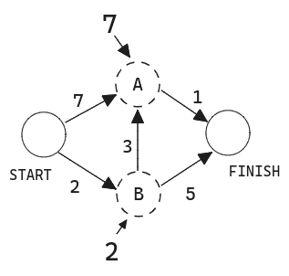
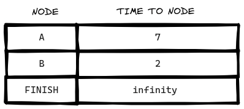
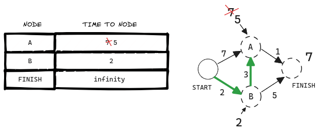
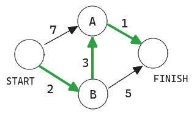
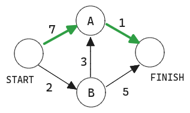
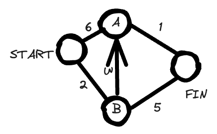

import Tabs from '@theme/Tabs';
import TabItem from '@theme/TabItem';

# Algoritmo de Dijkstra

El algoritmo de Dijkstra es un algoritmo para encontrar el camino más corto en un grafo ponderado, que puede representar, por ejemplo, redes de carreteras.


> El algoritmo de Dijkstra para encontrar el camino más corto entre _a_ y _b_.

La búsqueda " breadth first " encuentra el camino con el menor número de segmentos. ¿Y si lo que quiere es el camino más rápido? Puede hacerlo con un algoritmo diferente llamado algoritmo de Dijkstra.

## Trabajando con el algoritmo de Dijkstra

Supongamos que tenemos el siguiente gráfico.



Cada segmento tiene un tiempo de recorrido en minutos. Utilizarás el algoritmo de Dijkstra para ir de principio a fin en el menor tiempo posible.

Si ejecutas la búsqueda "breath-first" en este grafo, obtendrás este camino más corto.



Pero ese camino lleva 8 minutos. Veamos si puedes encontrar un camino que lleve menos tiempo. El algoritmo de Dijkstra consta de cuatro pasos:

1. Encuentra el nodo "más barato". El nodo al que puedes llegar en menos tiempo.
2. Actualiza el coste de los vecinos de este nodo.
3. Repite hasta que hayas hecho esto para cada nodo del grafo.
4. Calcula el camino final.

**Paso 1**: Encuentra el nodo más barato. Estás parado en la salida, preguntándote si deberías ir al nodo A o al nodo B. ¿Cuánto se tarda en llegar a cada nodo?



Tarda 7 minutos en llegar al nodo A y 2 minutos en llegar al nodo B.
El resto de nodos aún no los conoce.

Como aún no sabes cuánto se tarda en llegar a la meta, pones infinito. El nodo B es el más cercano... está a 2 minutos.



**Paso 2**: Calcular cuánto se tarda en llegar a todos los vecinos del nodo B siguiendo una arista desde B.



¡Acabas de encontrar un camino más corto al nodo A! Antes tardabas 7 minutos en llegar al nodo A.

Pero si pasas por el nodo B, hay un camino que sólo tarda 5 minutos.

Cuando encuentres un camino más corto para un vecino de B, actualiza su coste. En este caso, has encontrado

- Un camino más corto hasta A (de 7 minutos a 5 minutos)
- Un camino más corto hasta la meta (de infinito a 7 minutos).

**Paso 3**: ¡Repite!

Al final el camino final debería ser



Breadth-first search no habría encontrado esto como el camino más corto,
porque tiene tres segmentos. Y hay una manera de llegar desde el principio hasta el final
en dos segmentos.



## Terminología

Cuando trabajas con el algoritmo de Dijkstra, cada arista del grafo tiene asociado un número que se llama **pesos**.

Un grafo con pesos se llama grafo ponderado. Un grafo sin pesos se llama grafo no ponderado.

Para calcular el camino más corto en un grafo no ponderado se utiliza la búsqueda breath-first search. Para calcular el camino más corto en un grafo ponderado, se utiliza el algoritmo de Dijstra.

Los grafos también pueden tener ciclos.

Esto significa que puedes empezar en un nodo, dar una vuelta y terminar en el mismo nodo. Supongamos que intentas encontrar el camino más corto en este grafo que tiene un ciclo.

¿Tendría sentido seguir el ciclo? Bueno, puedes usar el camino que evita el ciclo.

O puedes seguir el ciclo.

Terminas en el nodo A de cualquier manera, pero el ciclo añade más peso. Incluso podrías seguir el ciclo dos veces si quisieras.

Pero cada vez que sigues el ciclo, estás añadiendo 8 al peso total. Así que seguir el ciclo nunca te dará el camino más corto.

Un grafo no dirigido significa que ambos nodos apuntan el uno al otro. ¡Eso es un ciclo!

El algoritmo de Dijkstra sólo funciona en **grafos sin ciclos**, o en grafos con un ciclo de peso positivo.

## Aristas de peso negativo

No puedes utilizar el algoritmo de Dijkstra si tienes aristas de peso negativo.

Las aristas de peso negativo rompen el algoritmo.

Dado que Dijkstra sigue un enfoque Greedy, una vez que un nodo es marcado como visitado no puede ser reconsiderado incluso si hay otro camino con menos coste o distancia.
otro camino con menor coste o distancia. Este problema sólo se plantea si existe
un peso negativo o una arista en el grafo.

Si quieres encontrar el camino más corto en un grafo que tiene aristas de peso negativo, ¡existe un algoritmo para ello!
Se llama algoritmo de Bellman-Ford.

## Implementación

Veamos la implementación del algoritmo de Dijkstra:

Gráfico del ejemplo:



Código:

<Tabs>
<TabItem value="js" label="JavaScript">

```js
// Graph initialisation
const graph = {};

// Weight representation
graph["start"] = {};
graph["start"]["a"] = 6;
graph["start"]["b"] = 2;

graph["a"] = {};
graph["a"]["fin"] = 1;

graph["b"] = {};
graph["b"]["a"] = 3;
graph["b"]["fin"] = 5;

graph["fin"] = {};

// Cost for each node
const infinity = Number.POSITIVE_INFINITY;
const costs = {};
costs["a"] = 6;
costs["b"] = 2;
costs["fin"] = infinity;

// Parents
const parents = {};
parents["a"] = "start";
parents["b"] = "start";
parents["fin"] = null;

const processed = [];

function findLowestCostNode(costs) {
  let lowestCost = infinity;
  let lowestCostNode = null;
  for (let node in costs) {
    const cost = costs[node];
    if (cost < lowestCost && !processed.includes(node)) {
      lowestCost = cost;
      lowestCostNode = node;
    }
  }
  return lowestCostNode;
}

function dijkstras(costs) {
  let node = findLowestCostNode(costs);
  while (node !== null) {
    const cost = costs[node];
    const neighbors = graph[node];
    for (let n in neighbors) {
      const newCost = cost + neighbors[n];
      if (costs[n] > newCost) {
        costs[n] = newCost;
        parents[n] = node;
      }
    }
    processed.push(node);
    node = findLowestCostNode(costs);
  }
}

dijkstras(costs);
```

</TabItem>
<TabItem value="py" label="Python">

```py
# Graph initialisation
graph = {}

# Weight representation
graph['start'] = {}
graph['start']['a'] = 6
graph['start']['b'] = 2

graph['a'] = {}
graph['a']['fin'] = 1

graph['b'] = {}
graph['b']['a'] = 3
graph['b']['fin'] = 5

graph['fin'] = {}

# Cost for each node
infinity = float('inf')
costs = {}
costs['a'] = 6
costs['b'] = 2
costs['fin'] = infinity

# Parents
parents = {}
parents['a'] = 'start'
parents['b'] = 'start'
parents['fin'] = None


processed =  []

def findLowestCostNode(costs):
            lowestCost = float('inf')
            lowestCostNode = None
            for node in costs:
                cost = costs[node]
                if cost < lowestCost and node not in processed:
                   lowestCost = cost
                   lowestCostNode = node
            return lowestCostNode

def dijkstras(costs):
        node = findLowestCostNode(costs)
        while node is not None:
            cost = costs[node]
            neighbors = graph[node]
            for n in neighbors.keys():
                newCost = cost + neighbors[n]
                if costs[n] > newCost:
                    costs[n] = newCost
                    parents[n] = node
            processed.append(node)
            node = findLowestCostNode(costs)

dijkstras(costs)
```

</TabItem>
</Tabs>

## Recap

- Para calcular el camino más corto de un grafo no ponderado se utiliza el algoritmo Breadth-first search.
- El algoritmo de Dijkstra se utiliza para calcular el camino más corto de un grafo ponderado.
- El algoritmo de Dijkstra funciona cuando todos los pesos son positivos.
- Si tiene pesos negativos, utilice el algoritmo de Bellman-Ford.
