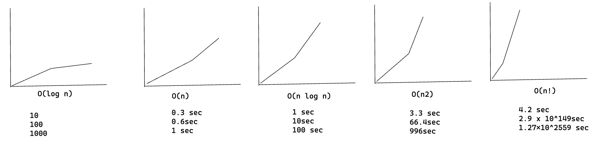
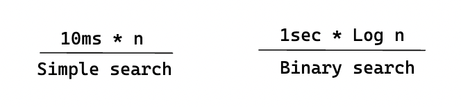

import Tabs from '@theme/Tabs';
import TabItem from '@theme/TabItem';

# Quicksort

Quicksort es un algoritmo de ordenación mucho más rápido que selection sort
(que aprendiste antes). Es un buen ejemplo de código elegante.

## Divide y vencerás

Quicksort emplea un paradigma de algoritmo basado en la recursividad. Este paradigma,
divide y vencerás, divide un problema en subproblemas similares al problema original,
resuelve recurrentemente los subproblemas y, por último, combina las soluciones
de los subproblemas para resolver el problema original. Dado que el algoritmo D&V
resuelve subproblemas de forma recurrente, cada subproblema debe ser más pequeño
que el problema original y debe existir un caso base para los subproblemas.
El algoritmo D&C consta de 3 partes:

1. **Dividir**: el problema en una serie de subproblemas que son instancias más pequeñas del mismo problema.
2. **Conquistar**: los subproblemas resolviéndolos recurrentemente. Si son lo suficientemente pequeños, resolver el subproblema como caso base.
3. **Combinar**: las soluciones de los subproblemas en el problema original.

## Quick sort en práctica

Utilicemos quicksort para ordenar un array. ¿Cuál es el array más simple que puede manejar un algoritmo de ordenación? Bueno, algunos arrays no necesitan ser ordenados en absoluto.

No es necesario ordenar un array así:

- Un array vacío
- Array con un elemento

Los arrays vacíos y los arrays con un solo elemento serán el caso base. Puedes devolver esos arrays tal cual, no hay nada que ordenar:

```py
def quicksort(array):
 if len(array) < 2:
  return array
```

Veamos arrays más grandes. Un array con dos elementos es bastante fácil de ordenar.

1. Comprueba si el primer elemento es menor que el segundo.
2. Si no lo es, intercámbialos.

¿Qué pasa con un array de tres elementos?

```
[24, 10, 7]
```

Recuerda, estás usando D&V. Así que quieres descomponer este array
hasta que estés en el caso base. Así es como funciona quicksort. Primero, escoge un elemento del array.
Este elemento se llama pivote.

Hablaremos de cómo elegir un buen pivote más adelante. Por ahora, digamos que el primer elemento del array es el pivote.

```
<24>
pivot
```

Ahora encuentra los elementos más pequeños que el pivote y los elementos más grandes que el pivote.

```
MENORES       MAYORES
        <24>
[10, 7]       [ ]
```

Esto se llama particionar. Ahora tiene

- Un subarray de todos los números menores que el pivote
- El pivote
- Un subarray de todos los números menores que el pivote  
  Las dos submatrices no están ordenadas. Sólo están particionadas. Pero si estuvieran ordenadas, entonces ordenar toda el array sería bastante fácil.

Si las submatrices están ordenadas, puedes combinar el conjunto así: el array izquierda + pivote + array derecha y obtendrás un array ordenado. En este caso, es `[7, 10] + [24] + [] = [7, 10, 24]`, que es un array ordenado.

¿Cómo se ordenan las submatrices? Bueno, el caso base de quicksort ya sabe ordenar matrices de dos elementos (el subarray izquierda) y matrices vacías (el subarray derecha). matrices vacías (el subarray derecha). Así que si llamas a quicksort en las dos submatrices y luego combinas los resultados, ¡obtienes un array ordenado!

```py
quicksort([7, 10] + [24] + [])
> 7, 10, 24 <----- A sorted array
```

Esto funcionará con cualquier pivote. Supongamos que elige 10 como el pivote en su lugar.

```
[7] <10> [24]
```

Ambas submatrices sólo tienen elementos, y ya sabes cómo ordenarlas. Ahora ya sabes cómo ordenar un array de tres elementos. Aquí están los pasos.

1. Elige un pivote.
2. Divide el array en dos subarrayas: elementos menores que el pivote y elementos mayores que el pivote.
3. Llamar a quicksort de forma recurrente en las dos submatrices.

¿Qué pasa con un array de cuatro elementos?

```
[24, 10, 12, 7]
```

Supongamos que eliges el 24 como pivote nuevamente

```
[10, 12, 7] <24> []
```

El array de la izquierda tiene tres elementos. Ya sabes cómo ordenar un array de tres elementos: llama a quicksort de forma recursiva.

```
[3, 5, 2, 1, 4]
```

Aquí tienes todas las formas en que puedes particionar este array, dependiendo del pivote que elijas.

```
[]<1> [3, 5, 2, 4]
[1]<2> [3, 5, 4]
[2, 1]<3> [5, 4]
[3, 2, 1]<4> [5]
[3, 2, 1, 4]<5>[]
```

Observe que todas estas submatrices tienen entre 0 y 4 elementos.
elementos. Y ya sabes cómo ordenar un array de 0 a 4 elementos usando quicksort. Así que no importa qué pivote elijas, puedes llamar a quicksort de forma recurrente en las dos submatrices.

Por ejemplo, supongamos que eliges 3 como pivote. Llamas a quicksort en las submatrices.

```
qsort([2,1])<3> qsort([5,4])
      [1,2]<3> [4,5]
      [1,2,3,4,5]
```

Las submatrices se ordenan y luego se combina todo para obtener un array ordenada.
Esto funciona incluso si eliges 5 como pivote.

```
qsort([3,2,1,4])<5>qsort([])
[1,2,3,4]<5>[]
[1,2,3,4,5]
```

Esto funciona con cualquier elemento como pivote. Así que puedes ordenar un array de cinco elementos.
Usando la misma lógica, puedes ordenar un array de seis elementos, y así sucesivamente.

### Pruebas inductivas

Acabas de echar un vistazo a las pruebas inductivas. Las pruebas inductivas son una forma de demostrar que tu algoritmo funciona. Una prueba inductiva tiene dos pasos: el caso base y el caso inductivo. ¿Te suena? Por ejemplo, supongamos que quiero demostrar que puedo subir a lo alto de una escalera. En el caso caso inductivo, si mis piernas están en un peldaño, puedo poner mis piernas en el siguiente peldaño. Así que si estoy en el peldaño, puedo subir al peldaño 3. Ese es el caso inductivo. Para el caso base, diré que mis piernas están en el peldaño 1. Por lo tanto, puedo subir toda la escalera. Por tanto, puedo subir toda la escalera, de peldaño en peldaño.

Utiliza un razonamiento similar para quicksort. En el caso base, mostré que el algoritmo funciona para el caso base: arrays de tamaño 0 y 1. En el caso inductivo, mostré que si quicksort funciona para un array de tamaño 1, funcionará para un array de tamaño 2 y así sucesivamente.

## Implementación

<Tabs>
<TabItem value="js" label="JavaScript">

```js
function quickSort(arr) {
  // base case: arrays with 0 or 1 element are already "sorted"
  if (arr.length <= 1) {
    return arr;
  }

  const pivot = arr[0];

  // partition the list into two sub-lists
  let left = [];
  let right = [];
  for (let i = 1; i < arr.length; i++) {
    if (arr[i] < pivot) {
      left.push(arr[i]);
    } else {
      right.push(arr[i]);
    }
  }

  // recursively sort the two sub-lists
  left = quickSort(left);
  right = quickSort(right);

  // combine the sorted sub-lists back into a single, sorted list
  return left.concat(pivot, right);
}
```

</TabItem>
<TabItem value="py" label="Python">

```py
def quicksort(array):
  if len(array) < 2:
    return array
  else:
    pivot = array[0]
    less = [i for i in array[1:] if i <= pivot]
    greater = [i for i in array[1:] if i > pivot]
    return quicksort(less) + [pivot] + quicksort(greater)
```

</TabItem>
</Tabs>

## La notación Big O revisitada

Quicksort es único porque su velocidad depende del pivote que elijas.  
Antes de hablar de quicksort, veamos los tiempos de ejecución más comunes de Big O
más comunes.



> Estimaciones basadas en un ordenador lento que realiza 10 operaciones por segundo

Cada tiempo de ejecución tiene también un algoritmo de ejemplo adjunto.

Hay otro algoritmo de ordenación llamado merged sort, que es O(n log n). Mucho más rápido. Quicksort es un caso complicado. En el peor de los casos, quicksort tarda O(n^2).

Es tan lento como la ordenación por selección. Pero ése es el peor caso. En el caso medio, quicksort tarda O(n log n). Así que te estarás preguntando:

- ¿Qué significan aquí peor caso y caso medio?
- Si quicksort es O(n log n) en promedio, pero merge sort es O(n log n)
  siempre, ¿por qué no usar merge sort? ¿No es más rápido?

## Merge sort vs. quicksort

Suponga que tiene esta sencilla función para imprimir cada vez en una lista:

```py
def print_items(list):
  for item in list:
    print item
```

Esta función recorre cada elemento de la lista y lo imprime. Como recorre toda la lista una vez, esta función se ejecuta en O(n) de tiempo. Ahora, supongamos que cambias esta función para que duerma durante 1 segundo antes de imprimir un elemento:

```py
from time import sleep
def print_items2(list):
  for item in list:
  sleep(1)
  print item
```

Antes de imprimir un elemento, hará una pausa de 1 segundo. Supongamos que imprime una lista de cinco elementos utilizando ambas funciones.

[3, 2, 4]

```shell
print_items: 3 2 4

print_items2: <sleep> 3<sleep> 2<sleep> 4
```

Ambas funciones recorren la lista una vez, por lo que ambas son de tiempo O(n).
¿Cuál crees que será más rápida en la práctica? Creo que `print_items` será mucho más rápida porque no hace una pausa de 1 segundo antes de imprimir un elemento. Así que aunque ambas funciones tienen la misma velocidad en notación Big O, `print_items` es es más rápida en la práctica. Cuando escribes notación Big O como O(n), en realidad significa esto.

```
some fixed amount of time -> c * n
```

c es una cantidad fija de tiempo que tarda tu algoritmo. Se llama constante.
Por ejemplo, puede ser 10 milisegundos _ n para `print_items` frente a 1 segundo _ n para `print_items2`.

Normalmente ignoras esa constante, porque si dos algoritmos tienen diferentes tiempos Big O, la constante no importa. Tomemos la búsqueda binaria y la búsqueda simple, por ejemplo.
Supongamos que ambos algoritmos tienen estas constantes.



La búsqueda simple parece más rápida, pero ¿y si buscas en una lista de 4.000 millones de elementos?
Aquí están los tiempos.


Como puedes ver, la búsqueda binaria sigue siendo mucho más rápida. Esa constante no hizo una diferencia en absoluto.

Pero a veces la constante puede marcar la diferencia. Quicksort versus merge sort es un ejemplo.

## Caso medio frente al peor caso

En el análisis del peor caso, calculamos el límite superior del tiempo de ejecución de un algoritmo. Es necesario conocer el caso que provoca la ejecución del máximo número de operaciones.

En el análisis del caso medio, tomamos todas las entradas posibles y calculamos el tiempo de cálculo para todas las entradas. Sumamos todos los valores calculados y dividimos la suma por el número total de entradas.

## Resumen

- D&V funciona dividiendo un problema en partes cada vez más pequeñas.
- Si estás implementando quicksort, elige un elemento aleatorio como pivote. El tiempo medio de ejecución de quicksort es O(n log n).
- La constante en notación Big O puede importar a veces. Por eso quicksort es más rápido que merge sort.
- La constante casi nunca importa para la búsqueda simple frente a la búsqueda binaria, porque O(log n) es mucho más rápido que O(n) cuando la lista es grande.
