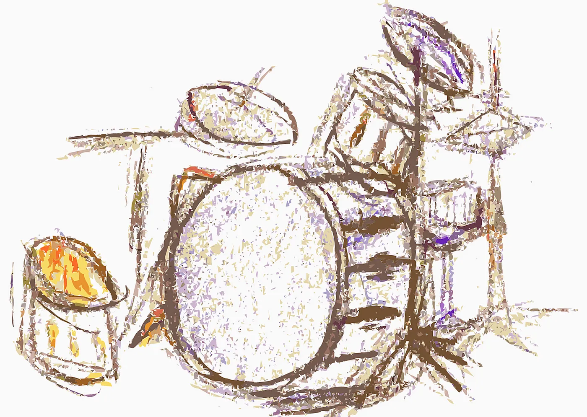
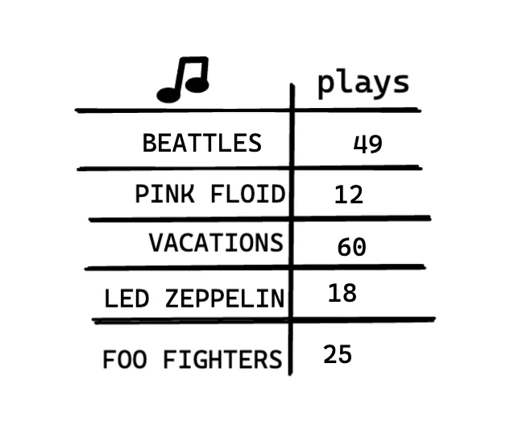
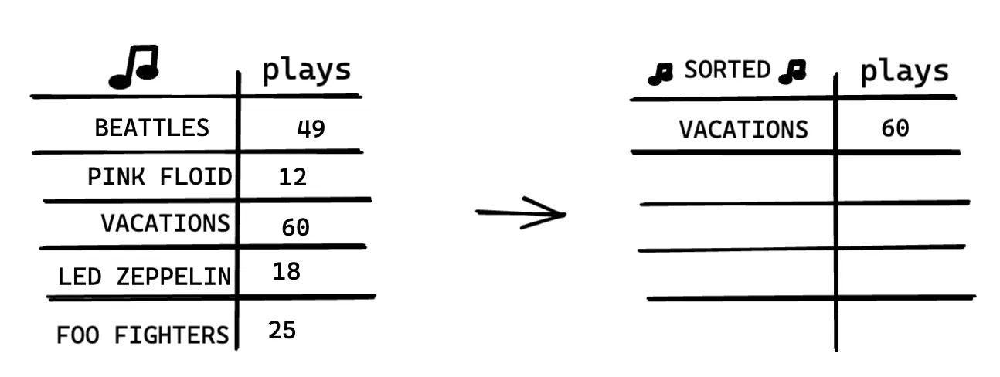

# Selection Sort

> En informática, la ordenación por selección es un algoritmo de ordenación por comparación en el lugar. - Wikipedia

## Analogía

Supongamos que tienes un montón de canciones en tu ordenador.

Para cada artista, tienes un número de reproducciones.

Quieres ordenar esta lista de mayor a menor número de reproducciones, para poder clasificar a tus artistas favoritos. ¿Cómo puedes hacerlo?

Una forma es recorrer la lista y encontrar el artista más reproducido. Añade ese artista a una nueva lista.

Vuelve a hacerlo para encontrar el siguiente artista más reproducido.

Sigue haciendo esto y obtendrás una lista ordenada.

## Complejidad temporal

Para encontrar el artista con el mayor número de reproducciones, tienes que comprobar cada elemento de la lista. Esto lleva O(n) tiempo,
como acabas de ver. Así que tienes una operación que lleva O(n) tiempo y tienes que hacerla n veces:

Esto toma O(n x n) tiempo o O(n^2) tiempo.

## Representación visual

Ordenar un array de menor a mayor.

## Resumen

La ordenación por selección es el algoritmo de ordenación más simple que funciona encontrando repetidamente el elemento mínimo (considerando orden ascendente)
de la parte no ordenada y poniéndolo al principio.

## Enlace a Implementación

- [Selection sort](https://github.com/kemilbeltre/sde-topics/tree/main/core/algorithms/selection-sort)
