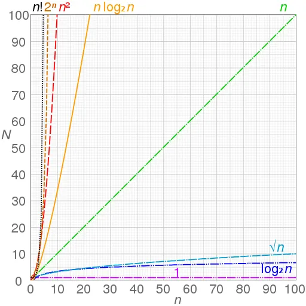

# Notación Big O

La notación Big O (O Grande) es una notación especial que te dice lo rápido que es un algoritmo. Vale, pero, ¿a quién le importa? La cuestión es que vas a utilizar mucho los algoritmos de otras personas y, cuando lo hagas, es bueno saber lo rápidos o lentos que son.

En esta sección, explicaremos en profundidad qué es la notación Big O y te daremos una lista de los tiempos de ejecución más comunes.

**Nota**: El termino en español es "Cota superior asintótica".

## Terminología

Se utiliza la letra O porque describe el tiempo de ejecución como si estuviera en el Orden de algo, que es una forma matemática de decir que dos cosas crecen de forma similar.

## ¿Qué significa "Notación"?

Una notación es una colección de símbolos relacionados, cada uno de los cuales tiene un significado arbitrario,
creada para facilitar la comunicación estructurada dentro de un dominio de conocimiento arbitrario, creado
para facilitar la comunicación estructurada en un ámbito de o campo de estudio.

Cuando se habla del tiempo de ejecución big-O de un fragmento de código, el tamaño de los datos de entrada recibe un nombre
de letra, normalmente N o n. A continuación, el big-O se denomina "tiempo de ejecución". datos de entrada se le da
un nombre, normalmente N o n. Entonces el big-O es una expresión en N que dice aproximadamente en cuántos pasos
que tardará en ejecutarse el código.

## ¿Qué NO es Cota superior asintótica?

Con Big O, no medimos la velocidad de un algoritmo en segundos (o minutos). Medimos la velocidad de crecimiento de un algoritmo
en el número de operaciones que tarda en completarse. Big O NO representa el mejor escenario. Big O
establece el tiempo en el peor de los casos. Así que se puede decir que, en el peor de los casos, tendrá un
tiempo de ejecución en orden de "número de operaciones".

## Complejidad Temporal y Espacial

- **Complejidad temporal**: Esto es lo que significa el concepto de tiempo de ejecución asintótico, o tiempo big O.

- **Complejidad espacial**: El tiempo no es lo único que importa en un algoritmo.
  de memoria o espacio que necesita un algoritmo.

La complejidad espacial es un concepto paralelo a la complejidad temporal. Si necesitamos crear una matriz de tamaño n, necesitaremos O(n) de espacio. Si necesitamos
una matriz bidimensional de tamaño n por n, necesitaremos O(n²) de espacio.

## Algunos tiempos de comunes habituales en Big O

Aquí tienes cinco tiempos de ejecución Big O que encontrarás a menudo, ordenados del más rápido al más lento:

- **O(log n)**, también conocido como tiempo logarítmico. Ejemplo: Búsqueda binaria.
- **O(n)**, también conocido como tiempo lineal. Ejemplo: Búsqueda simple: Búsqueda simple.
- **O(n \* log n)**. Ejemplo: Un algoritmo de ordenación rápido, como quicksort.
- **O(n²)**. Ejemplo: Un algoritmo de ordenación lento, como selection sort.
- **O(n!)**. Ejemplo: Un algoritmo realmente lento, como el vendedor ambulante.

## 4 Reglas importantes para entender Big O

### 1. Diferentes pasos añadidos

Esto significa que si tienes dos pasos diferentes en tus algoritmos sumas pasos. Así que si usted tiene un primer paso que toma O(a)
y un segundo paso que tarda O(b), sumarías esos tiempos de ejecución y obtendrías O(a+b).

Ejemplo:

```javascript
function doSomething() {
  // doStep1() -> O(a)
  // doStep2() -> O(b)
  // time comeplexity -> O(a+b)
}
```

### 2. Eliminar las constantes

Supongamos que queremos imprimir el elemento `min` y el elemento `max` de un array, hay muchas formas, en este caso, tenemos dos:

```javascript
function minMax1(array) {
  let max = array[0];
  let min = array[0];

  for (let val of array) {
    if (val > max) max = val;
  }

  for (let val of array) {
    if (val < min) min = val;
  }

  return { min, max };
}
```

```javascript
function minMax2(array) {
  let max = array[0];
  let min = array[0];

  for (let val of array) {
    if (val > max) max = val;
    if (val < min) min = val;
  }

  return { min, max };
}
```

La primera función encuentra el elemento `max` y luego encuentra el elemento `min`, y la otra encuentra el `min` y el `max` simultáneamente.
Ahora, estos están básicamente realizando la misma cosa, están haciendo exactamente las mismas operaciones,
sólo que las hacen en órdenes ligeramente diferentes.

Ambas se describen como O(n) donde n es el tamaño de la matriz. Ahora es realmente tentador para la gente a veces ver dos
bucles diferentes y describirlo como O(2n) y es importante que recuerdes que dejas las constantes en Big O.

No describes las cosas como O(2n), O(3n) -> O(n) porque estas buscando cómo las cosas escalan aproximadamente. ¿Es una relación lineal?
es cuadrática... Siempre eliminas las constantes.

### 3. Diferentes entradas -> Diferentes variables

Big O es una ecuación que expresa cómo cambia el tiempo de ejecución y cómo se escala.

Veamos un ejemplo en el que tenemos dos arrays y estamos recorriéndolos para averiguar el número de elementos en común entre
los dos arrays:

```javascript
function intersectionSize(arrayA, arrayB) {
  let count = 0;

  for (let a of arrayA) {
    for (let b of arrayB) {
      if (a === b) count = count + 1;
    }
  }

  return count;
}
```

Algunas personas lo llaman erróneamente O(n²), pero no es correcto. Cuando sólo se toma sobre el tiempo de ejecución si usted describe las cosas como O(n),
O(log n), etc. n debe tener un significado no es como las cosas son inherentemente uno sobre el otro.

Cuando usted describe esto como O(n²) no tiene sentido porque n no es el tamaño de la matriz, si hay dos diferentes
matrices. Lo que quieres describir en su lugar es O(a\*b).

### 4. Eliminar los terminos no dominantes

Lo que esto significa simplemente es que cuando tienes diferentes bloques funcionando en diferentes momentos, el Big O debería ser el peor escenario.

```javascript
function doSomething() {
  // doStep1() -> O(n)
  // doStep2() -> O(n^2)
  // time comeplexity -> O(n^2)
}
```

En este caso, el tiempo de ejecución cuadrático es más dominante que el lineal.

## Grafíco



Los gráficos de funciones utilizadas habitualmente en el análisis de algoritmos muestran los datos (tamaño de entrada n) frente al tiempo (el número de pasos N)
para cada función.

## Resumen

- Elimina los términos no dominantes, Big O establece un tiempo en el peor de los casos.
- Si se eliminan las constantes, lo que se busca es cómo se escalan las cosas aproximadamente.
- O(log n) es más rápido que O(n), pero se vuelve mucho más rápido una vez que la lista de elementos que estás buscando crece.
- La velocidad de un algoritmo no se mide en segundos.
- Los tiempos de los algoritmos se miden en términos de crecimiento de un algoritmo.
- Los tiempos de los algoritmos se escriben con la notación Big O.
