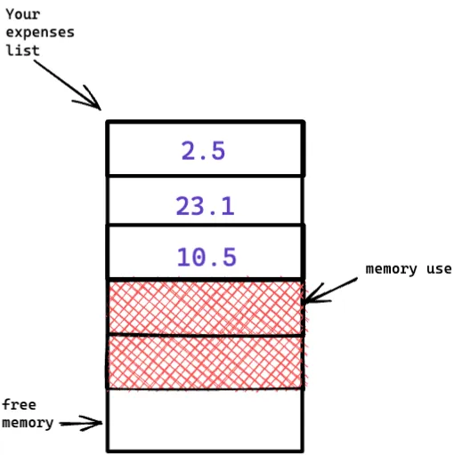
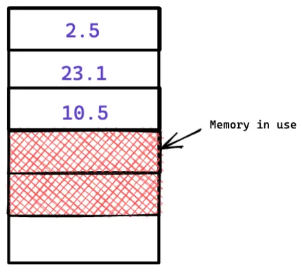
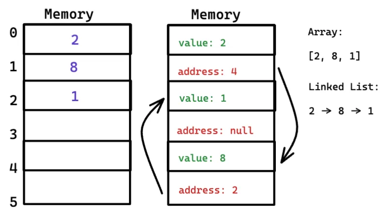
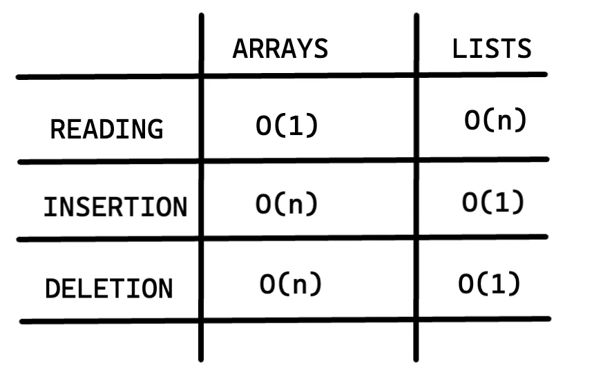

# Arrays y listas enlazadas

A veces necesitas almacenar una lista de elementos en memoria. Supongamos que estás escribiendo una aplicación para gestionar tus gastos. Querrás almacenar los gastos como una lista en memoria.

¿Deberías usar un array, o una lista enlazada? Vamos a almacenar los gastos en una matriz en primer lugar, porque es más fácil de entender. Utilizar una matriz significa que todos los gastos se almacenan de forma contigua (uno al lado del otro) en la memoria.

Ahora supongamos que quiere añadir un cuarto gasto. Pero el siguiente cajón está ocupado.

Es como salir con tus amigos y encontrar un sitio para sentarte, pero se te une otro amigo y no hay sitio para él. Tenéis que cambiaros a un nuevo sitio donde quepáis todos. En este caso tienes que pedir a tu ordenador un trozo diferente de memoria en el que quepan cuatro gastos. Entonces necesitas mover todos tus gastos allí.

Y esto se convertirá en un bucle tan pronto como más amigos se unan a ti, pero asegúrate de que siempre puedes añadir ranuras adicionales por si acaso. Esta es una buena solución, pero debes tener en cuenta un par de inconvenientes:

Puede que no necesites las ranuras extra que pediste, y entonces esa memoria se desperdiciará.
Puede que añadas más de 10 artículos a tu lista de gastos y tengas que moverte de todos modos.
Así que es una buena solución, pero no es una solución perfecta. Las listas enlazadas resuelven este problema de añadir elementos.

## Listas enlazadas

Una lista enlazada es una colección lineal de elementos de datos cuyo orden no viene dado por su ubicación física en memoria. En su lugar, cada elemento apunta al siguiente.

Con una lista enlazada, los elementos pueden estar en cualquier lugar de la memoria.

## Acceso secuencial vs aleatorio

**Acceso secuencial** significa que el coste de acceder al 5º elemento es 5 veces el coste de acceder al primer elemento, o al menos que hay un coste creciente asociado a la posición de un elemento en el conjunto. Esto se debe a que para acceder al 5º elemento del conjunto, primero hay que realizar una operación para encontrar el 1º, 2º, 3º y 4º elemento, por lo que acceder al 5º elemento requiere 5 operaciones.

**Acceso aleatorio** significa que acceder a cualquier elemento del conjunto tiene el mismo coste que cualquier otro elemento del conjunto. Encontrar el 5º elemento de un conjunto sigue siendo una sola operación.

## Array vs LinkedList

En un array conocemos la dirección de cada elemento del array. Como podemos ver en la imagen anterior tenemos un array con 5 unidades de memoria y este array contiene 3 elementos, como los elementos están almacenados en posiciones de memoria contiguas (los elementos de un array están numerados y esta numeración empieza por 0) sabemos donde empieza y donde acaba.

> La posición de un elemento se llama su índice, así que en lugar de decir "8 está en la posición 1", la terminología correcta es "8 está en el índice 1".

Los arrays son geniales si quieres leer elementos aleatorios, porque puedes buscar cualquier elemento en tu array instantáneamente.

En una lista enlazada, cada elemento almacena la dirección del siguiente elemento de la lista. Se enlazan un montón de direcciones de memoria aleatorias.

Es como una búsqueda del tesoro. Vas a la primera dirección, y dice: "El siguiente elemento se puede encontrar en la dirección 008". Así que vas a la dirección 008, y dice: "El siguiente elemento se puede encontrar en la dirección 002" y así sucesivamente.

Añadir un elemento a una lista enlazada es fácil: lo metes en cualquier lugar de la memoria y almacenas la dirección con el siguiente elemento anterior.

Con una lista enlazada, nunca tienes que mover los elementos. También evitas otro problema.

Supongamos que vas a ver una película popular con cuatro de tus amigos. Los cinco intentáis encontrar un sitio para sentaros, pero el cine está abarrotado. No hay cinco asientos juntos.

Pues bien, a veces esto ocurre con las matrices. Digamos que estás tratando de encontrar 40.000 ranuras, para un array. Tu memoria tiene 40.000 slots, pero no tiene 40.000 slots juntos. ¡No puedes conseguir espacio para tu array!

Una lista enlazada es como decir "Separémonos y veamos la película". Si hay espacio en memoria, tienes espacio para tu lista enlazada.

Si las listas enlazadas son mucho mejores para insertar, ¿para qué sirven los arrays?

## Arrays

Los arrays son mejores que las listas enlazadas cuando intentamos acceder a nuestros elementos en la lista.

Supongamos que quieres leer el penúltimo elemento de una lista enlazada. No puedes simplemente leerlo, porque no sabes en qué dirección está.

Tienes que ir al elemento #1 para obtener la dirección del elemento #2 y así sucesivamente, hasta que llegues al penúltimo elemento.

Las listas enlazadas son geniales si vas a leer todos los elementos de uno en uno. Pero si vas a ir saltando de un elemento a otro, las listas enlazadas son terribles.

Las matrices son diferentes. Conoces la dirección de cada elemento de tu matriz, así que puedes acceder a cualquier elemento inmediatamente.

## Insertar en medio de una lista

Suponga que quiere que su lista de gastos funcione más como un calendario. Antes, añadías cosas al final de la lista.

Ahora quieres añadirlas en el orden en que deben hacerse.

¿Qué es mejor si quieres insertar elementos en el medio: matrices o listas enlazadas? Con las listas enlazadas, es tan fácil como cambiar a qué apunta el elemento anterior.

Pero para los arrays, tienes que desplazar el resto de los elementos hacia abajo.

Y si no hay espacio, ¡puede que tengas que copiarlo todo a una nueva ubicación! Las listas son mejores si quieres insertar elementos en el medio.

## Borrado

¿Qué pasa si quieres borrar un elemento? De nuevo, las listas enlazadas son mejores, porque sólo necesitas cambiar a qué apunta el elemento anterior. Con arrays todo necesita ser movido hacia arriba cuando borras un elemento.

### Tiempos de ejecución de operaciones comunes con arrays y listas:

Tiempos de ejecución de operaciones comunes
Las inserciones y eliminaciones son O(1) porque normalmente se rastrean el primer y el último elemento de una lista enlazada, por lo que sólo se tarda O(1) en añadir o eliminar.

¿Qué se utiliza más: las matrices o las listas enlazadas? Obviamente, depende del caso de uso. Pero las matrices se utilizan mucho porque permiten el acceso aleatorio.
