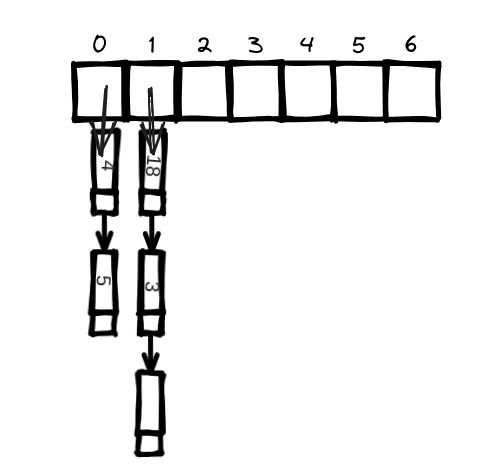

# Tablas Hash

Supongamos que trabajas en una tienda de comestibles. Cuando un cliente compra un producto, tienes que buscar el precio en un libro.
Si el libro no está alfabetizado, puede llevar mucho tiempo buscar el plátano en cada línea. Estarías haciendo una búsqueda simple,
en la que tienes que mirar cada línea. Como ya sabes la búsqueda simple toma O(n) tiempo. Si el libro está ordenado alfabéticamente,
podrías ejecutar una búsqueda binaria para encontrar el precio de un plátano. Eso sólo llevaría  O(log n) tiempo.

Ya sabes que la búsqueda binaria es más rápida. Pero como cajero, buscar cosas en un libro es un coñazo, aunque el libro esté ordenado.
Lo que realmente necesitas es algo con todos los nombres y precios memorizados. Entonces no necesitas buscar nada: preguntas y 
obtendrás la respuesta al instante.

El sistema puede darte el precio en tiempo O(1) para cualquier producto, sea del tamaño que sea. Es incluso más rápido que la búsqueda binaria.

¡Impresionante! ¿Cómo se consigue eso?

La respuesta es sencilla: funciones hash.

## Funciones Hash

Una función hash es una función en la que se introduce una cadena y se obtiene un número.


Hay algunos requisitos para las funciones hash:

- Tiene que ser consistente.
- Debe asignar diferentes palabras a diferentes números.

Así que una función hash mapea cadenas a números. ¿Para qué sirve? Bueno, puedes usarla para hacer tu "diccionario de precios".

Empieza con un array


Almacenarás todos tus precios en el array, hasta que todo el array esté lleno.

Y entonces podrás pedir cualquier precio que hayas puesto.

La función hash te dice exactamente dónde está almacenado el precio, ¡así que no tienes que buscar en absoluto! Esto funciona porque:

- La función hash mapea consistentemente un nombre al mismo índice.
- La función hash asigna diferentes cadenas a diferentes índices.
- La función hash sabe lo grande que es tu array y sólo devuelve índices válidos.

Junta una función hash y un array, y obtendrás una estructura de datos llamada tabla hash.

Probablemente nunca tendrás que implementar tablas hash tú mismo.

## Casos de uso 

Las tablas hash se utilizan en todas partes.

### Uso de tablas hash para búsquedas

Tu teléfono tiene una bonita agenda integrada.

Cada nombre tiene asociado un número de teléfono.

Este es un caso de uso perfecto para las tablas hash. Las tablas hash son geniales cuando quieres

- Crear un mapa de una cosa a otra cosa.
- Buscar algo.

¿Cómo crear una agenda telefónica?

1. Crea una nueva tabla hash:

`>>> phone_book = {}`

2. Añade el número de teléfono de algunas personas:

`>>> phone_book["john"] = 1234`  
`>>> phone_book["Kay"] = 4288`

Eso es todo. Ahora supongamos que quieres encontrar el número de John. Sólo tienes que pasar la clave en el hash:

`>>> print phone_book["john"]`

`1234 <------------- John's phone number`


Las tablas hash se utilizan para búsquedas a gran escala. Por ejemplo,
supongamos que vas a un sitio web como `https://google.com`. Su ordenador
tiene que traducir `https://google.com` a una dirección IP.

Para cualquier sitio web que visite, la dirección tiene que ser traducida a una dirección IP.

`https://google.com`. ----> 64.233.160.0

Un caso de uso perfecto para las tablas hash. Este proceso se denomina resolución DNS.
Las tablas hash son una forma de proporcionar esta funcionalidad.

### Evitar entradas duplicadas


Supón que tienes una biblioteca enorme con miles de libros y quieres organizarlos de forma que te resulte fácil encontrar cualquier 
libro rápidamente. Sin embargo, no quiere tener ejemplares duplicados del mismo libro ocupando espacio innecesario en las estanterías.

Cada libro puede estar representado por su ISBN (International Standard Book Number) único, que actúa como su identificador. La tabla hash
será como una estantería virtual donde se almacenan los libros en función de su ISBN.

Este es el código:

```python
books = {}

def check_book(isbn):
        if book.get(isbn):
            print "already exists in the library"
        else:
            books[isbn] = True
            print "add this book to the library"
```

Vamos a probarlo unas cuantas veces:

```
>> check_book('1234')
add this book to the library
>> check_book('7878')
add this book to the library
>> check_book('7878')
already exists in the library
```

Como puede ver, cuando intentamos añadir el mismo libro dos veces, se imprime, "already exists in the library"

Si almacenara estos ISBN en una lista, esta función se volvería muy lenta, porque tendría que ejecutar una simple búsqueda en toda
la lista. realmente lenta, porque tendría que ejecutar una simple búsqueda en toda la lista. Pero estás almacenando los ISBN en
una tabla hash, y una tabla hash te dice instantáneamente si el ISBN de este libro está en la tabla hash o no. La búsqueda de
duplicados es muy rápida con una tabla hash.

### Uso de tablas hash como caché

Supongamos que visitas twitter.com:

1. Haces una petición al servidor de Twitter.
2. El servidor piensa un segundo y le proponerciona la página web que debe enviarle.
3. Usted obtiene una página web.

El almacenamiento en caché es sencillo: los sitios web recuerdan los datos en lugar de recalcularlos.

Si estás conectado a Twitter, todo el contenido que ves está hecho a tu medida. Cada vez que entras en twitter.com, los servidores tienen
que pensar en el contenido que te interesa. Pero si no has iniciado sesión en Twitter, verás la página de inicio de sesión. Todo el mundo
ve la misma página de inicio de sesión. A Twitter se le pide lo mismo una y otra vez: "Volver a la página de inicio cuando el usuario ha
cerrado la sesión". Así que deja de hacer trabajar al servidor para averiguar cómo es la página de inicio. En su lugar, memoriza el aspecto
de la página de inicio y te la envía.

Esto se llama almacenamiento en caché. Tiene dos ventajas:

- Obtienes la página web más rápido, igual que cuando memorizas algo.
- El servidor del sitio web tiene que hacer menos trabajo.

El almacenamiento en caché es una forma común de hacer las cosas más rápidas. Todos los grandes sitios web utilizan el almacenamiento en caché. 
¡Y esos datos se almacenan en caché en un hash!

Aquí está en código:

```python
cache = {}

def getPage(url):
  if cache.get(url):
    return cache(url) # returns cached data
  else:
    data = getDataFromServer(url)
    cache[url] = data # saves this data is your cache first
    return data
```

Aquí, haces que el servidor trabaje sólo si la URL no está en la caché. Sin embargo, antes de devolver los datos, los guarda en la caché.
La próxima vez que alguien solicite esta URL, puedes enviar los datos desde la caché en lugar de hacer que el servidor haga el trabajo.

### Recapitulación

Recapitulando, los hashes sirven para:

- Modelar relaciones de una cosa con otra cosa.
- Filtrar duplicados.
- Almacenar/memorizar datos en lugar de hacer trabajar al servidor.

## Colisiones

Para entender el rendimiento de las tablas hash, primero hay que entender qué son las colisiones.

Una colisión se produce cuando dos claves tienen asignada la misma ranura.

Hay muchas maneras de tratar las colisiones. La más sencilla es la siguiente: si varias claves se asignan a la misma ranura,
inicia una lista enlazada en esa ranura.

Pero supongamos que tenemos una tabla hash en la que sólo almacenamos elementos que empiezan por la letra A.

Toda la tabla hash está totalmente vacía excepto una ranura. Y esa ranura es una lista enlazada gigante. Eso es tan malo como poner todo
en una lista enlazada para empezar. Va a ralentizar su la tabla hash.

Hay dos lecciones aquí:

- Tu función hash es realmente importante. Tu función hash mapea todas las claves a una sola ranura. Idealmente, tu función hash mapearía las llaves
uniformemente por todo el hash.
- Si esas listas enlazadas se hacen largas, ralentizará mucho tu tabla hash. Pero no se harán largas si usas una buena función hash.

Una buena función hash te dará muy pocas colisiones.

## Rendimiento

En el caso medio, las tablas hash tardan O(1) para todo. O(1) se llama tiempo constante. No significa instantáneo. Significa que el tiempo empleado
será el mismo, independientemente del tamaño de la tabla hash.

Eso significa que no importa si tu tabla hash tiene 1 elemento o 1 billón de elementos, sacar algo de una tabla hash llevará la misma cantidad de tiempo.

En el peor de los casos, una tabla hash tarda O(n) o tiempo lineal para todo, lo que es realmente lento.

Es importante que no llegues al peor caso de rendimiento con tablas hash. Y para hacer eso, necesitas evitar colisiones. Para evitar colisiones necesitas

- Un factor de carga bajo
- Una buena función hash

> Nota: Cualquier lenguaje de programación que utilices tendrá una implementación de tablas hash incorporada. Puedes usar la tabla hash incorporada y 
asumir que tendrá un buen rendimiento.

### Factor de carga
El factor de carga de una tabla hash es fácil de calcular.

El número de elementos en las tablas hash se divide por el número total de ranuras.

Las tablas hash utilizan una matriz para el almacenamiento, por lo que se cuenta el número de ranuras ocupadas en una matriz.

El factor de carga mide cuántas ranuras vacías quedan en tu tabla hash.

Tener un factor de carga mayor que 1 significa que tienes más elementos que ranuras en tu array.

Una vez que el factor de carga empieza a crecer, necesitas añadir más huecos a tu tabla hash. Esto se llama redimensionar.

La regla general es hacer un array que tenga el doble de tamaño. Luego reinserta todos esos elementos en esta nueva tabla hash usando la función hash.

Con un factor de carga menor, tendrás menos colisiones y tu tabla funcionará mejor. Una buena regla general es redimensionar cuando el factor de carga sea superior a 0,7.

Las tablas hash tardan O(1) incluso con redimensionamiento.

### Una buena función hash

Una buena función hash distribuye los valores en la matriz de manera uniforme.


Una mala función hash agrupa los valores y produce muchas colisiones.



## Recap

- Nunca tendrás que implementar tú mismo una función hash.
- Las tablas hash son realmente rápidas a la hora de buscar, insertar y borrar.
- Una vez que tu factor de carga sea superior a 0,7, es hora de redimensionar tu tabla hash.
- Las tablas hash se utilizan para modelar relaciones de un elemento a otro y almacenar datos en caché.
- Las tablas hash son excelentes para detectar duplicados.
