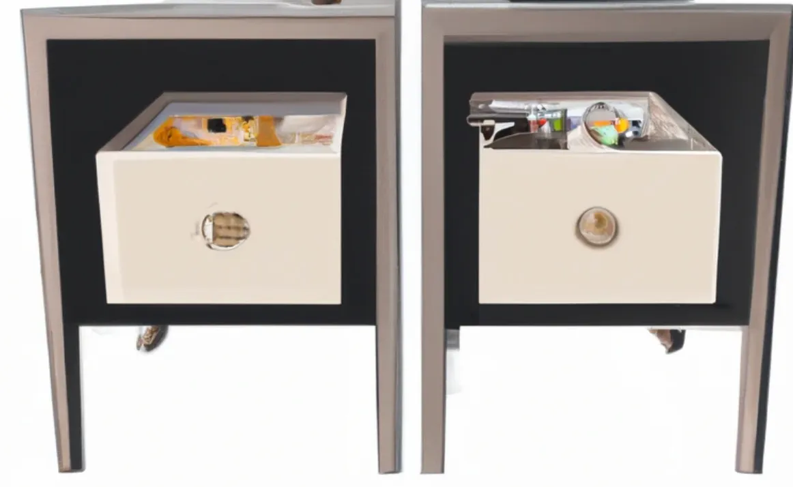

# ¿Cómo funcina la memoría?

Imagine que va a una exposición y necesita guardar sus cosas. Hay una cómoda disponible.

En cada cajón cabe un elemento. Si quieres guardar dos cosas, pides dos cajones.

¡Y ya estás listo para el espectáculo! Así es como funciona básicamente la memoria de tu ordenador. Tu ordenador parece un conjunto gigante de cajones, y cada cajón tiene una dirección.

Un chip de memoria es un circuito muy simple que se compone de un número muy grande típicamente muy grande de ciertas unidades que vamos a llamar "unidades direccionables"

Estas unidades direccionables tienen cierto número de bits en su interior y es donde se almacena la información.

¿Por qué llamamos a estas unidades direccionables? Lo llamamos así porque cada una de ellas tiene una dirección que va desde cero hasta tamaño - 1.

Cada vez que quieres almacenar un elemento en la memoria, le pides espacio al ordenador, y éste te da una dirección donde puedes almacenar tu elemento.
