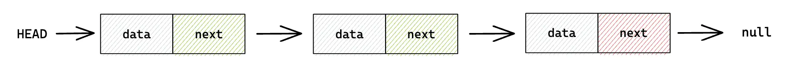
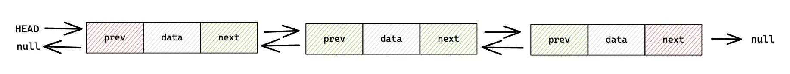
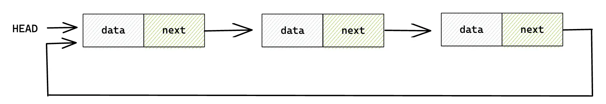

# Tipos de Listas Enlazadas

Hay muchos tipos de listas enlazadas y esta seccion vas a aprender las más importantes.

Una lista enlazada es una estructura de datos lineal que incluye una serie de nodos
que estan conectados.

Piensa en una lista enlazada como una cadena de casillas, donde cada casilla contiene un dato y un puntero
a la siguiente casilla de la cadena. El puntero indica al ordenador dónde se encuentra la siguiente
casilla en la memoria. A diferencia de los arrays, donde los datos se almacenan en un bloque
de memoria de tamaño fijo, las listas enlazadas permiten flexibilidad en el tamaño
de los datos y pueden redimensionarse dinámicamente.

Por ejemplo, imagine una lista enlazada que contenga los números 1, 2 y 3. La primera casilla de la cadena contendría
el número 1 y un puntero a la siguiente caja. La segunda casilla contendría el número 2 y un a la tercera caja. La
tercera casilla contendría el número 3 y un puntero nulo para indicar el final de la lista.

Las listas enlazadas son útiles en situaciones en las que es necesario añadir o eliminar datos con frecuencia, ya que pueden modificarse
fácilmente sin tener que desplazar grandes bloques de memoria. También se utilizan en diversas aplicaciones, como los
gráficos por ordenador, donde se emplean para representar formas o animaciones.

## Lista Enlazada Simple

En una lista enlazada simple, cada nodo tiene una referencia al siguiente nodo de la secuencia, pero no hay referencia
al nodo anterior. Esto hace que las listas enlazadas simples sean eficiente de implementar, pero puede
hacer que ciertas operaciones, como invertir la lista más difíciles.

## Lista Doblement Enlazada

En una lista doblemente enlazada, cada nodo tiene una referencia tanto al nodo siguiente como al anterior
de la secuencia. Esto hace que las listas doblemente enlazadas sean más versátiles que las listas que
las listas enlazadas simples, pero también requiere más memoria para almacenar
las referencias adicionales.

## Lista Enlazada Circular

En una lista circular enlazada, el último nodo de la secuencia tiene una referencia al primer nodo, formando
una estructura circular. Esto permite recorrer la lista de forma eficiente, pero también puede complicar
ciertas operaciones, como encontrar el final de la lista, más complicadas.

